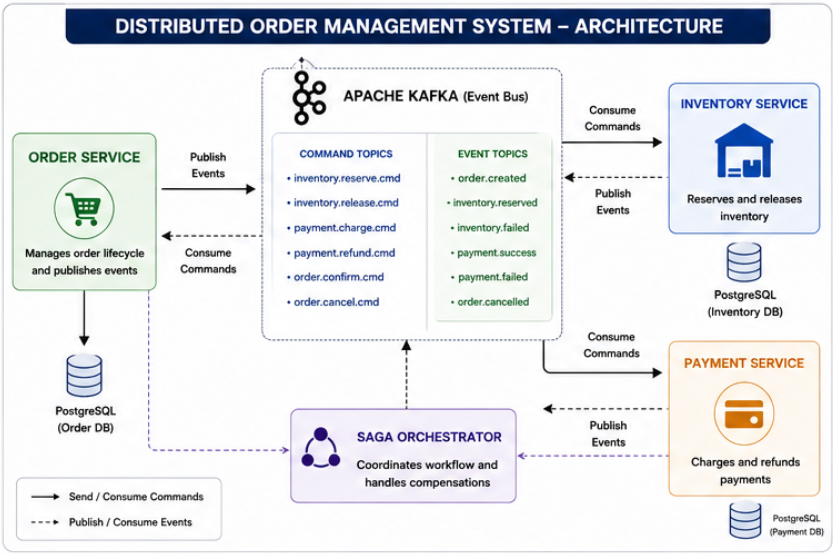
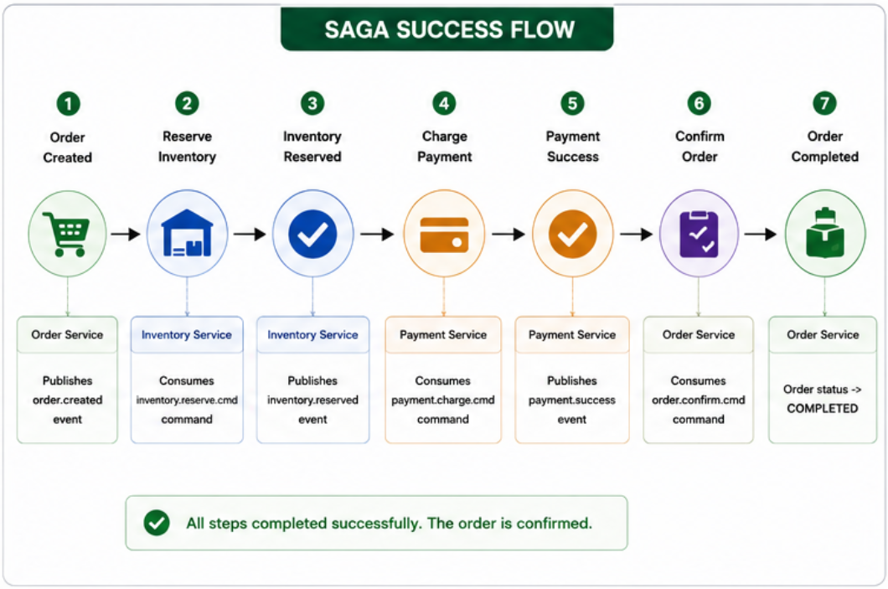
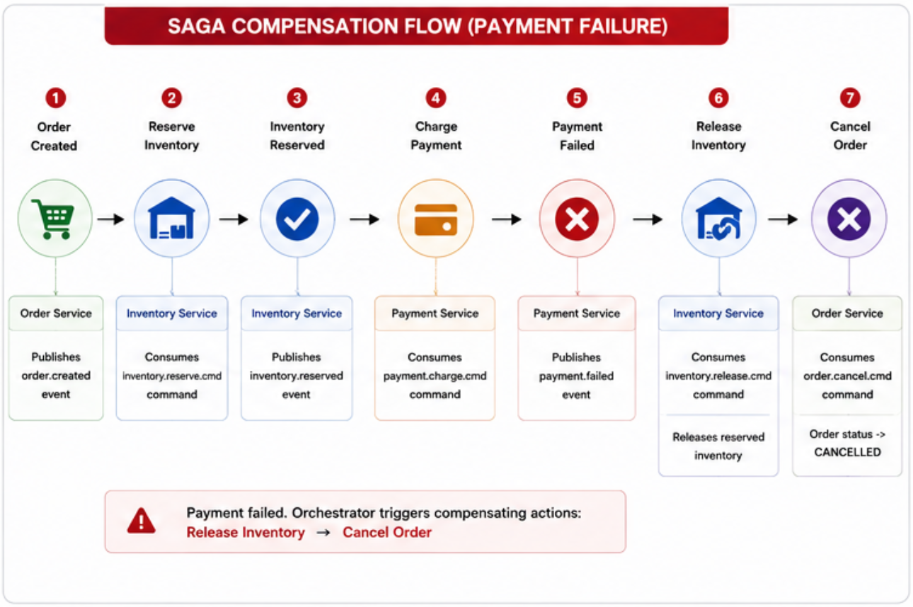
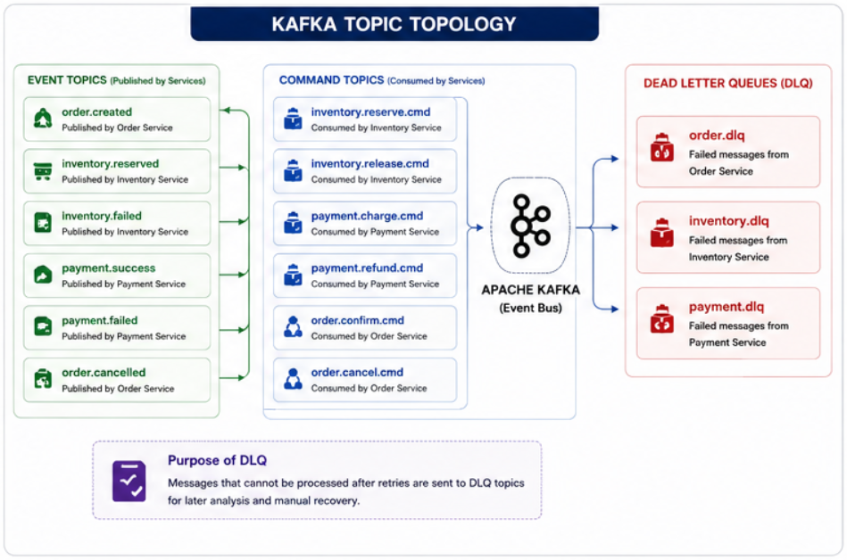

# 📦 Distributed Order Management System

### Event-Driven Microservices using Saga Orchestration Pattern


---

## 📌 Overview

This project is a **production-inspired distributed order management platform** built using **Spring Boot**, **Apache Kafka**, and **PostgreSQL**.

The system demonstrates how distributed transactions can be coordinated without using traditional two-phase commits. Instead, it uses the **Saga Orchestration Pattern**, where a dedicated orchestrator manages workflows and triggers compensation actions when failures occur.

The platform consists of independent microservices communicating asynchronously through Kafka events and commands.

---

# 🚀 Distributed Systems Concepts Demonstrated

* Saga Orchestration Pattern
* Event-Driven Architecture
* Asynchronous Messaging
* Compensation Transactions
* Eventual Consistency
* Dead Letter Queues (DLQ)
* Retry Mechanisms
* Idempotent Consumers
* Optimistic Locking
* Distributed Tracing
* Correlation IDs
* Fault Isolation
* Loose Coupling

---

# 🏗️ System Architecture



---

## Microservices

| Service           | Responsibility                       |
| ----------------- | ------------------------------------ |
| Order Service     | Order lifecycle management           |
| Inventory Service | Stock reservation and release        |
| Payment Service   | Payment processing and refunds       |
| Saga Orchestrator | Coordinates distributed transactions |
| Kafka             | Event streaming and messaging        |
| PostgreSQL        | Persistent storage                   |

---

# 🔄 Saga Success Flow



### Workflow

```text
Order Created
      ↓
Reserve Inventory
      ↓
Inventory Reserved
      ↓
Charge Payment
      ↓
Payment Success
      ↓
Confirm Order
      ↓
Order Completed
```

---

# ⚠️ Compensation Flow



### Failure Scenario

```text
Order Created
      ↓
Reserve Inventory
      ↓
Inventory Reserved
      ↓
Charge Payment
      ↓
Payment Failed
      ↓
Release Inventory
      ↓
Cancel Order
      ↓
Order Failed
```

---

# 📊 Order State Lifecycle

```text
CREATED
     ↓
INVENTORY_RESERVED
     ↓
COMPLETED
```

### Intermediate States

```text
PAYMENT_SUCCESS_PENDING
PAYMENT_FAILED_PENDING
FAILED
CANCELLED
```

---

# 📨 Kafka Topic Topology



---

## Event Topics

```text
order.created

inventory.reserved
inventory.failed

payment.success
payment.failed

order.cancelled
```

---

## Command Topics

```text
inventory.reserve.cmd
inventory.release.cmd

payment.charge.cmd
payment.refund.cmd

order.confirm.cmd
order.cancel.cmd
```

---

## Dead Letter Queues

```text
order.dlq

inventory.dlq

payment.dlq
```

---

# 🧩 Saga Orchestrator

The Saga Orchestrator acts as the central coordinator of distributed transactions.

### Responsibilities

* Listens to domain events
* Determines next action
* Sends commands to services
* Handles failures
* Triggers compensation workflows
* Maintains eventual consistency

---

## Event Flow

| Event              | Action                           |
| ------------------ | -------------------------------- |
| order.created      | Reserve inventory                |
| inventory.reserved | Charge payment                   |
| inventory.failed   | Cancel order                     |
| payment.success    | Confirm order                    |
| payment.failed     | Release inventory + Cancel order |

---

# 🔁 Reliability Features

## Dead Letter Queues (DLQ)

Failed messages are redirected to dedicated DLQ topics for later analysis and recovery.

---

## Retry Handling

Spring Kafka consumers use retry policies through `DefaultErrorHandler`.

---

## Idempotency

Duplicate Kafka deliveries do not result in duplicate business operations.

---

## Optimistic Locking

Version-based locking prevents concurrent order update conflicts.

---

## Distributed Tracing

Each request propagates a correlation identifier:

```text
traceId = orderNumber
```

MDC logging enables request tracking across microservices.

---

## Structured Saga Logs

```text
[SAGA] [SERVICE] [TRACE] [ORDER] [STEP] [STATUS]
```

Example:

```text
[SAGA] [ORDER] [TRACE:ORD-123]
[STEP:PAYMENT_SUCCESS]
[STATUS:SUCCESS]
```

---

# 💰 Monetary Handling

All financial calculations use:

```java
java.math.BigDecimal
```

Floating-point types are avoided to ensure precision.

---

# 📁 Project Structure

```text
distributed-order-system
│
├── order-service
│
├── inventory-service
│
├── payment-service
│
├── saga-orchestrator
│
└── common-dto
```

Each service follows:

```text
controller
service
repository
entity
dto
kafka
config
exception
```

---

# ⚙️ Technology Stack

| Technology      | Purpose               |
| --------------- | --------------------- |
| Java 17         | Programming Language  |
| Spring Boot     | Backend Framework     |
| Spring Kafka    | Messaging Integration |
| Apache Kafka    | Message Broker        |
| Spring Data JPA | Persistence           |
| Hibernate       | ORM                   |
| PostgreSQL      | Database              |
| Lombok          | Boilerplate Reduction |
| Jackson         | Serialization         |
| Docker          | Containerization      |

---

# ▶️ Running the Project

## 1. Start Kafka

```bash
docker-compose up
```

---

## 2. Start Services

Run:

```text
order-service

inventory-service

payment-service

saga-orchestrator
```

---

## 3. Create Order

```http
POST /orders
```

Saga execution starts automatically.

---

# 📈 Current Status

## Completed

* Order Service
* Inventory Service
* Payment Service
* Saga Orchestrator
* Kafka Producers and Consumers
* Command/Event Messaging
* DLQ Handling
* Retry Mechanism
* Compensation Transactions
* Distributed Tracing
* MDC Logging
* Optimistic Locking
* Idempotent Consumers

---

## Planned Enhancements

* Payment Refund Workflow
* Saga State Persistence
* Redis State Store
* OpenTelemetry + Zipkin
* Prometheus Metrics
* Grafana Dashboard
* Docker Compose Setup
* Kubernetes Deployment
* Circuit Breakers using Resilience4j
* Exactly-Once Semantics

---

# 🧠 Learning Outcomes

This project demonstrates:

* Distributed Transactions
* Saga Orchestration
* Event-Driven Microservices
* Kafka Command/Event Architecture
* Compensation Transactions
* Reliability Patterns
* Failure Recovery
* Production-grade Backend Design

---

# 👩‍💻 Author

**Deepana Balmoor**

Associate Software Engineer | Java Backend Developer

GitHub:
https://github.com/dbalmoor

LinkedIn:
https://linkedin.com/in/deepanabalmoor
