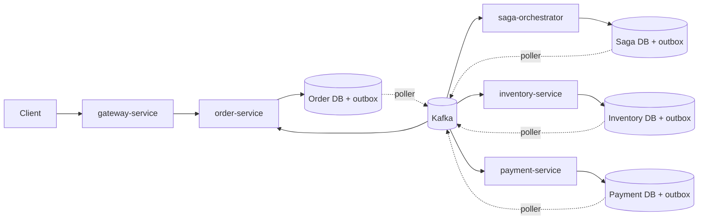
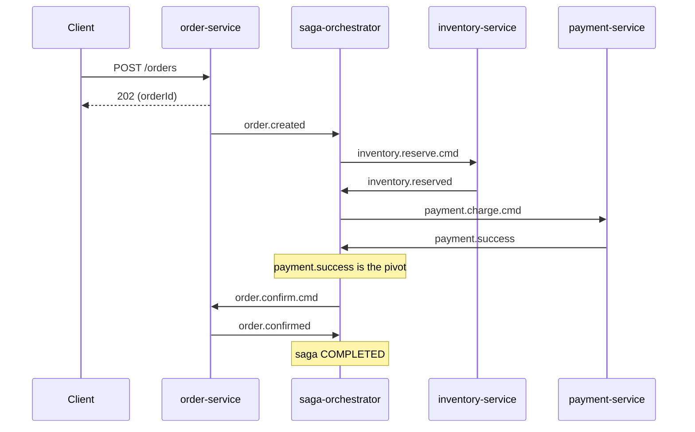
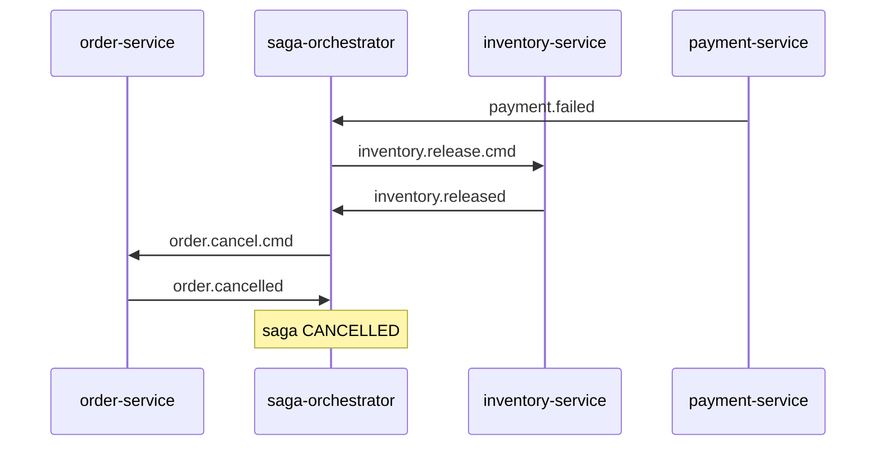
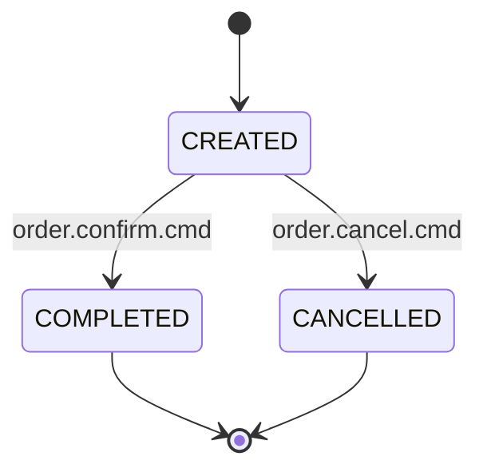
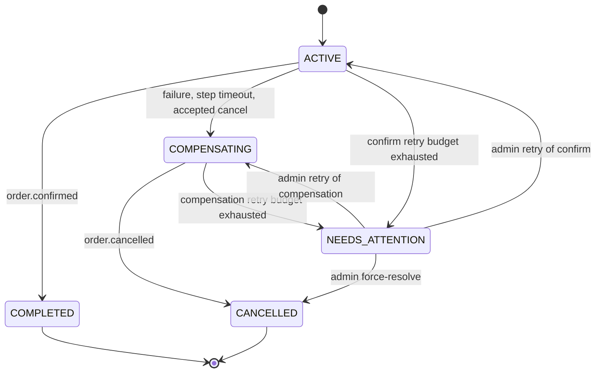

# Distributed Order Management System

Saga orchestration with Spring Boot, Kafka and PostgreSQL, built for correctness under failure.


## Overview

An order is placed through REST and then moves through inventory reservation, payment and confirmation. Each step lives in a separate service with its own database. There is no distributed transaction. A saga orchestrator coordinates the steps and runs compensating actions when something fails.

The guarantees:

- **At-least-once delivery with idempotent effects.** Exactly-once is not claimed.
- **No lost messages.** State changes and outgoing messages are committed together through a transactional outbox.
- **No duplicate business effects.** Every consumer is idempotent by a natural key or message id.
- **A single writer for order status.** The orchestrator decides by emitting commands; `order-service` is the only service that writes the status.
- **Recoverable orchestration.** Saga state is persisted, so the orchestrator resumes after a restart.

The as-built architecture is described in [`design.md`](design.md). Pending
requirements and future work are tracked separately in [`requirement.md`](requirement.md).

## Services

| Module | Responsibility |
|---|---|
| `order-service` | Order REST API and the order state machine. Changes status only on `order.confirm.cmd` / `order.cancel.cmd`. |
| `inventory-service` | Pessimistically locked stock reservation and conditional stock release, with idempotency markers. |
| `payment-service` | Idempotent charge and refund, keyed by `(saga_id, type)`. |
| `saga-orchestrator` | Persistent saga state, state machine, compensation, watchdog and admin recovery API. |
| `gateway-service` | API routing. Currently `permitAll` (see Known limitations). |
| `common-dto` | Shared command and event contracts. |

Each DB-owning service has its own PostgreSQL database with Flyway migrations (`ddl-auto=validate`). Every service that publishes to Kafka has its own outbox table and poller.

## Architecture



Each business write and its outbox row are committed in one transaction. A poller then publishes the row to Kafka after the commit.

## Happy path



## Compensation

Payment failure releases the reserved stock first, and only then cancels the order:



Other cases:

- **Inventory failure.** Reservation is all-or-nothing, so there is nothing to release. The saga goes straight to `order.cancel.cmd`.
- **Cancel request before the pivot.** The saga sends the needed release (and refund, if a charge was in flight). It cancels the order only after both acknowledgements arrive.
- **Cancel request after the pivot.** Rejected. The order completes.
- **Late `payment.success` after compensation.** The event is recorded as `LATE_SUCCESS` in `saga_step_log`; at most one `payment.refund.cmd` is sent. A saga still waiting for compensation acknowledgements remains `COMPENSATING` until cancellation can complete.
- **Late `inventory.reserved` after compensation.** Rejected with no side effects, then counted and logged.
- **Release before reserve, refund before charge.** A `RELEASED` or `REFUNDED` marker makes the later reserve or charge fail, so nothing is held or charged.

## State machines

### Order



`CREATED` is shown to clients as `PENDING`. A repeated command that matches the current terminal state is a logged no-op. A conflicting command is rejected and logged.

### Saga



`NEEDS_ATTENTION` is a non-terminal recovery state. A normal timeout never ends there. It is used only when a confirm or compensation step cannot be acknowledged within its retry budget.

## Reliability mechanisms

| Concern | Mechanism |
|---|---|
| Lost messages | Transactional outbox in every publishing service. The poller claims rows with `FOR UPDATE SKIP LOCKED` and a lease, publishes outside the claim transaction, then marks the row `PUBLISHED` or `FAILED`. |
| Ordering | Kafka key is `orderId` on every topic. The poller processes one aggregate's rows in `created_at` order and a failed row blocks later rows of that aggregate. |
| Producer safety | `acks=all`, `enable.idempotence=true`, bounded retries. |
| Duplicate payment | `UNIQUE(saga_id, type)` with `INSERT ... ON CONFLICT DO NOTHING`. A repeat re-emits the stored outcome. |
| Duplicate inventory | `processed_inventory_events` with `UNIQUE(saga_id, event_type)` and the release-before-reserve `RELEASED` marker. Reservation currently uses a pessimistic row lock and availability check; see [Design items not yet implemented](#design-items-not-yet-implemented). |
| Duplicate at orchestrator | `processed_message` table keyed by `(consumer_name, message_id)`. |
| Concurrent events for one saga | Each handler locks the saga row with `SELECT ... FOR UPDATE`. `version` is a safety net. |
| Crash recovery | Saga state, step log and outbox are persisted. The orchestrator resumes from the last durable step. |
| Stuck sagas | A watchdog scans overdue sagas. Each step has a configurable deadline. A reservation is valid only until the saga deadline. |
| Transient failures and poison messages | Listeners use bounded `@RetryableTopic` retries for configured transient errors. Permanent/unlisted errors route to a DLT. Each service exposes an operator replay endpoint. |

## Kafka topics

All topics use `orderId` as the key and 6 partitions. Retry and DLT topics follow `@RetryableTopic` naming (`<topic>-retry-N`, `<topic>-dlt`).

| Topic | Producer | Consumer |
|---|---|---|
| `order.created` | order-service | saga-orchestrator |
| `order.cancel.requested` | order-service | saga-orchestrator |
| `order.confirm.cmd` | saga-orchestrator | order-service |
| `order.cancel.cmd` | saga-orchestrator | order-service |
| `order.confirmed` | order-service | saga-orchestrator |
| `order.cancelled` | order-service | saga-orchestrator |
| `inventory.reserve.cmd` | saga-orchestrator | inventory-service |
| `inventory.release.cmd` | saga-orchestrator | inventory-service |
| `inventory.reserved` | inventory-service | saga-orchestrator |
| `inventory.failed` | inventory-service | saga-orchestrator |
| `inventory.released` | inventory-service | saga-orchestrator |
| `payment.charge.cmd` | saga-orchestrator | payment-service |
| `payment.refund.cmd` | saga-orchestrator | payment-service |
| `payment.success` | payment-service | saga-orchestrator |
| `payment.failed` | payment-service | saga-orchestrator |
| `payment.refunded` | payment-service | saga-orchestrator |

Message headers: `messageId`, `sagaId`, `orderId`, `traceId`, `eventType`. `sagaId` is a String UUID everywhere.

## Failure matrix

The [failure matrix](docs/failure-matrix.md) maps scenarios to the automated test method that proves them. Rows marked `NO TEST` identify design scenarios without direct automated coverage.

## Running locally

Prerequisites: JDK 17, Maven, Docker.

```bash
cp .env.example .env        # adjust ports and credentials if needed
docker compose up -d        # Kafka (KRaft) and one PostgreSQL per service
mvn -B verify               # builds every module and runs all tests
```

Then start each service from your IDE or with `mvn -pl <module> spring-boot:run`.

Create an order:

```http
POST /orders
GET  /orders/{id}
PUT  /orders/{id}/cancel
```

- `POST /orders` returns `202` with the order id. Poll `GET /orders/{id}` for the outcome.
- `PUT /orders/{id}/cancel` does not change the status itself. It records a cancel request that the orchestrator accepts only before the payment pivot. It returns `202`, and the outcome is visible through `GET /orders/{id}`.

Payment is a deterministic simulation. Set the configured failure threshold (`PAYMENT_FAIL_AMOUNT_THRESHOLD`) to trigger payment failures. With nothing configured, every charge succeeds.

The orchestrator exposes `GET /admin/sagas/needs-attention`, `POST /admin/sagas/{sagaId}/retry`, and `POST /admin/sagas/{sagaId}/force-resolve`. Each service exposes `POST /admin/kafka/dlt/replay`, accepting a DLT topic, partition, offset, and dry-run option. Admin and DLT replay endpoints are unauthenticated and are not routed through the gateway; do not expose service ports publicly.

## Testing

- Unit tests cover the order and saga state machines, including valid, no-op and rejected transitions.
- Integration tests use Testcontainers (Kafka and PostgreSQL) through a shared `IntegrationTestBase` per service. They cover business idempotency, outbox rollback/recovery/concurrent pollers, saga persistence, compensation and watchdog timeouts. Startup tests assert retry-listener configuration, consumer groups and topic/partition creation. There are no end-to-end tests for transient retry delivery, poison-to-DLT routing, or replay behavior yet; see the [failure matrix](docs/failure-matrix.md).
- Docker must be running. CI runs `mvn -B verify` on GitHub Actions.

Key test classes:

| Module | Test classes |
|---|---|
| `common-dto` | `CommonDtoApplicationTests`, `DocumentationConsistencyTest` |
| `order-service` | `OrderStateMachineIntegrationTest`, `OrderStateMachineTest`, `OutboxIntegrationTest`, `OrderServiceApplicationTests` |
| `inventory-service` | `InventoryOutboxIntegrationTest`, `InventoryServiceImplTest`, `InventoryServiceApplicationTests` |
| `payment-service` | `PaymentIdempotencyIntegrationTest`, `PaymentServiceApplicationTests` |
| `saga-orchestrator` | `SagaPersistenceIntegrationTest`, `SagaStateMachineTest`, `SagaOrchestratorApplicationTests` |
| `gateway-service` | `GatewayServiceApplicationTests` |

## Implementation status

| Phase | Scope | Status |
|---|---|---|
| 0 | Parent POM, CI, Flyway baseline, Docker Compose, Testcontainers base | Done |
| 1 | Idempotent payment charge, deterministic failure rule | Done |
| 2 | Single-writer order state machine | Done |
| 3 | Transactional outbox (order, inventory, payment) | Done |
| 4 | Persistent saga state, orchestrator outbox | Done |
| 5 | Compensation, watchdog, `NEEDS_ATTENTION`, admin recovery | Done |
| 6 | Retry, DLQ, consumer configuration | Done |
| 7 | OpenTelemetry tracing, structured JSON logs, metrics, dashboards | Not started |
| 8 | ADRs and failure matrix tied to tests | Done |

Not yet implemented:

- **Observability.** There is no distributed tracing, Prometheus metrics or Grafana yet. Logs carry `traceId` through MDC only.
- **Client idempotency.** The `Idempotency-Key` header on `POST /orders` is not implemented, so a retried request can create two orders.
- **API hygiene.** Request validation and standard error payloads are not yet standardized.
- **Chaos-lite harness.** There is no fault-injection harness beyond the integration tests.

## Design items not yet implemented

- **Inventory reservation design (R16).** The design selects an atomic conditional decrement as the primary oversell guard. Current `InventoryServiceImpl.processReserve` instead locks each inventory row with `findByProductIdForUpdate`, checks `availableQty`, then saves the entity; the conditional SQL update currently applies to release only.
- **End-to-end retry/DLT verification (Phase 6).** Tests check listener annotations, group configuration and topic creation/partitions, but do not exercise retry-then-success, poison-to-DLT without partition blocking, or DLT replay idempotence.
- **Inventory duplicate-reserve behavior.** `processed_inventory_events` prevents a second stock mutation, but a duplicate `inventory.reserve.cmd` currently returns without re-emitting the original acknowledgement; no dedicated integration test covers this path.

## Known limitations

- The gateway uses `permitAll`. There is no authentication or authorization.
- Delivery is at-least-once with idempotent processing. Exactly-once is not claimed.
- The outbox uses a simple poller rather than CDC, so latency and throughput are limited.
- The orchestrator is hand-rolled. A workflow engine such as Temporal would provide timers, retries and history out of the box.
- DLT replay is a manual operator action, and `NEEDS_ATTENTION` sagas need operator intervention.
- Payment is a deterministic simulation. There is no real provider, reconciliation or unknown-outcome handling.
- The shared `common-dto` module couples deployments. Schema versioning is out of scope.

## Documentation

- [`design.md`](design.md): the architecture and behavior implemented in the repository.
- [`requirement.md`](requirement.md): Phase 7 and other pending requirements and future work.
- [Architecture decision records](docs/adr/README.md): index of orchestration, outbox, idempotency, inventory contention, retry/DLQ, shared DTO and order-status decisions.
- [Failure matrix](docs/failure-matrix.md): scenarios mapped to automated test methods, with missing coverage called out explicitly.

## Author

**Deepana Balmoor**, Java Backend Developer
GitHub: https://github.com/dbalmoor
LinkedIn: https://linkedin.com/in/deepanabalmoor
