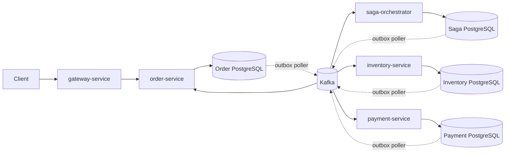
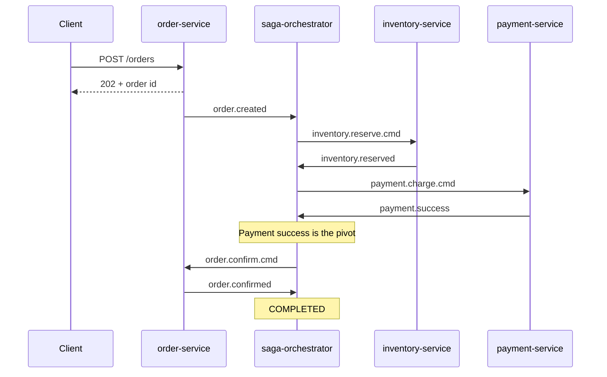
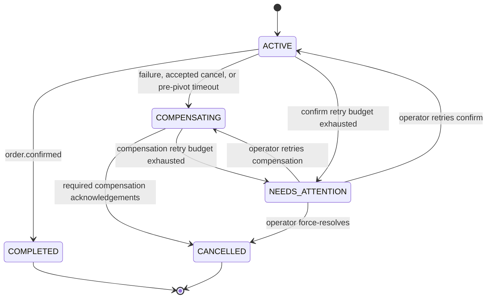

# Distributed Order Management System

Event-driven order processing with a **persisted Saga orchestrator**, **transactional outbox**, and **idempotent consumers** on Spring Boot and Kafka. Built to explore what it takes to keep distributed workflows correct when messages are duplicated, delayed, reordered, or lost.


<!-- TODO: add a CI badge once GitHub Actions runs `mvn -B verify` -->

> This is a learning and portfolio project. Payment is a deterministic simulation, and several production concerns (auth, metrics, real tracing) are intentionally not built yet. See [Known limitations](#known-limitations).

---

## What it does

A client places an order. The system reserves inventory, charges payment, and confirms the order, each step owned by a separate service with its own database. If any step fails, times out, or is cancelled, the orchestrator compensates in the right order and leaves the order in a consistent final state.

- No distributed (2PC) transactions: consistency comes from a saga plus local transactions.
- Delivery is **at-least-once**. Every consumer is safe against duplicates and late events.
- Stuck workflows are detected and recovered automatically, and escalated to an operator when automatic recovery is exhausted.

## Architecture



| Module | Responsibility |
|---|---|
| `order-service` | Creates and reads orders, records cancellation requests, applies confirm/cancel commands. The only writer of order status. |
| `inventory-service` | Reserves and releases stock; records processed events. |
| `payment-service` | Simulated charge and refund, protected by an idempotency key. |
| `saga-orchestrator` | Persists saga state, advances the workflow, runs compensation, timeouts, and operator recovery. |
| `gateway-service` | Routes client traffic to services (currently unauthenticated, see limitations). |
| `common-dto` | Shared Kafka command and event payloads. |

Each service that owns data has its own PostgreSQL database and Flyway migrations. JPA runs in `validate` mode only.

## Happy path



`POST /orders` returns `202 Accepted`; clients read the outcome through the order REST API.

## Failure handling

Payment success is the **pivot**. Before it, a failure, timeout, or accepted cancellation triggers compensation. After it, the saga only moves forward and retries confirmation.

| Scenario | Behaviour |
|---|---|
| Inventory fails | Order is cancelled; no release is needed because nothing was reserved. |
| Payment fails | `inventory.release.cmd` is sent; the order is cancelled only after `inventory.released`. |
| Charge times out | Outcome is unknown, so the orchestrator sends both release and refund before cancelling. |
| Confirm times out | Past the pivot: resend `order.confirm.cmd` with backoff. Never compensates. |
| Compensation ack missing | The missing compensation command is resent with backoff. |
| Retry budget exhausted | Saga moves to `NEEDS_ATTENTION` for an operator. |
| Release arrives before reserve | Inventory stores a `RELEASED` marker, so the late reserve has no effect. |
| Refund arrives before charge | Payment stores a `REFUNDED` marker, so the late charge has no effect. |
| Late `payment.success` during compensation | At most one refund is issued. |
| Late `inventory.reserved` after compensation starts | Payment is not triggered. |
| Duplicate or invalid-for-state events | Recorded and rejected; no additional business effect. |

The scenario-level coverage is tracked in the [failure matrix](docs/failure-matrix.md).

### Saga state machine



## Reliability design

**Transactional outbox.** Each service writes its state change and its outgoing message in one database transaction. A poller claims rows with `FOR UPDATE SKIP LOCKED` and a lease, publishes to Kafka, then records success or failure. This avoids the dual-write problem. Delivery is at-least-once, not exactly-once.

**Idempotent consumers.**
- Payment: unique `(saga_id, type)` key; duplicate charge/refund requests return the stored outcome.
- Inventory: processed-event records plus the `RELEASED` marker.
- Orchestrator: `processed_message` table (consumer + message id) and row locks while handling an event; an optimistic version column is an additional check.

**Kafka.**
- Records are keyed by `orderId`, so one order's events stay in sequence while different orders run in parallel across 6 partitions.
- Producers use `acks=all` with idempotence enabled.
- Listeners use Spring Kafka retry topics (`<topic>-retry-N`) with bounded attempts and dead-letter topics (`<topic>-dlt`).
- Each service exposes `POST /admin/kafka/dlt/replay` (topic, partition, offset, dry-run) to republish a dead-lettered record after a fix.

**Stuck-saga watchdog.** `SagaWatchdog` finds expired `ACTIVE` or `COMPENSATING` sagas using `FOR UPDATE SKIP LOCKED`, so multiple instances can run safely. Every transition sets a deadline for the next step.

| Step | Default deadline |
|---|---|
| Inventory reservation | 30 s |
| Payment | 60 s |
| Order confirmation | 30 s |
| Compensation | 60 s |

Saga state, audit log (`saga_step_log`), and outgoing outbox messages are written in the same transaction.

### Kafka topics

| Topic | Producer | Consumer |
|---|---|---|
| `order.created` | order-service | saga-orchestrator |
| `order.cancel.requested` | order-service | saga-orchestrator |
| `order.confirm.cmd` | saga-orchestrator | order-service |
| `order.cancel.cmd` | saga-orchestrator | order-service |
| `order.confirmed` | order-service | saga-orchestrator |
| `order.cancelled` | order-service | saga-orchestrator |
| `inventory.reserve.cmd` | saga-orchestrator | inventory-service |
| `inventory.release.cmd` | saga-orchestrator | inventory-service |
| `inventory.reserved` | inventory-service | saga-orchestrator |
| `inventory.failed` | inventory-service | saga-orchestrator |
| `inventory.released` | inventory-service | saga-orchestrator |
| `payment.charge.cmd` | saga-orchestrator | payment-service |
| `payment.refund.cmd` | saga-orchestrator | payment-service |
| `payment.success` | payment-service | saga-orchestrator |
| `payment.failed` | payment-service | saga-orchestrator |
| `payment.refunded` | payment-service | saga-orchestrator |

Messages carry `messageId`, `sagaId`, `orderId`, and `traceId`.

## Operator APIs

Served directly by `saga-orchestrator` (not routed through the gateway):

| Method and path | Purpose |
|---|---|
| `GET /admin/sagas/needs-attention` | List sagas awaiting operator action. |
| `POST /admin/sagas/{sagaId}/retry` | Retry `CONFIRM` or `COMPENSATION`; resets the retry budget. |
| `POST /admin/sagas/{sagaId}/force-resolve` | Resolve to `CANCELLED`; requires an operator note. |

Every operator action is recorded in `saga_step_log`.

## Getting started

**Prerequisites:** Java 17, Maven, Docker.

```bash
# 1. Start Kafka (KRaft) and the service databases
docker compose -f up -d

# 2. Build and run all tests (Testcontainers needs Docker running)
mvn -B verify

# 3. Run each service in its own terminal
mvn -pl order-service spring-boot:run
mvn -pl inventory-service spring-boot:run
mvn -pl payment-service spring-boot:run
mvn -pl saga-orchestrator spring-boot:run
```

Create an order:

```bash
curl --location 'http://localhost:8081/orders' \
--header 'Content-Type: application/json' \
--data '{
  "userId": 102,
  "paymentType": "ONLINE",
  "fulfillmentType": "DELIVERY",
  "items": [
    {
      "productId": 1,
      "quantity": 2,
      "price": 500
    },
    {
      "productId": 2,
      "quantity": 1,
      "price": 1200
    }
  ]
}
'
```

The response is `202` with an order id. Poll `GET /orders/{id}` for the result (`CREATED` is shown as `PENDING`).

## Testing

`mvn -B verify` runs unit and integration tests. Integration tests use **Testcontainers** for Kafka and PostgreSQL, so Docker must be available.

| Module | Test classes |
|---|---|
| `common-dto` | `CommonDtoApplicationTests`, `DocumentationConsistencyTest` |
| `order-service` | `OrderStateMachineIntegrationTest`, `OrderStateMachineTest`, `OutboxIntegrationTest`, `OrderServiceApplicationTests` |
| `inventory-service` | `InventoryOutboxIntegrationTest`, `InventoryServiceImplTest`, `InventoryServiceApplicationTests` |
| `payment-service` | `PaymentIdempotencyIntegrationTest`, `PaymentServiceApplicationTests` |
| `saga-orchestrator` | `SagaPersistenceIntegrationTest`, `SagaStateMachineTest`, `SagaOrchestratorApplicationTests` |
| `gateway-service` | `GatewayServiceApplicationTests` |

Not yet covered by dedicated automated integration tests: end-to-end retry/DLT behaviour and DLT replay.

## Design decisions

- **Orchestration over choreography.** One place owns the workflow, timeouts, and compensation order, which makes failure handling explicit and debuggable at the cost of a central component.
- **Outbox over dual writes.** Publishing directly to Kafka after a DB commit can lose or duplicate messages; the outbox makes both writes atomic and moves delivery to a retryable poller.
- **Kafka over synchronous REST between services.** Commands are durable records, so a downstream service can be down and catch up later. For simple lookups needing an immediate answer, REST remains the better fit.
- **Key by `orderId`.** Preserves per-order ordering while allowing parallelism across partitions.
- **Tolerate duplicates instead of chasing exactly-once.** At-least-once delivery plus idempotent handlers is simpler and honest about what Kafka guarantees here.
- **Pessimistic lock on inventory, optimistic version on orders and sagas.** See limitations for the inventory trade-off.

## Known limitations

This section is deliberate; these are known gaps, not oversights.

- **No authentication or authorization.** The gateway permits all requests; admin and DLT-replay endpoints are unauthenticated and not routed through the gateway. Do not expose service ports publicly.
- **Payment is a simulation**, not a real provider.
- **Inventory reservation** loads the product row `FOR UPDATE`, checks quantity, then saves. An atomic conditional decrement would reduce contention on hot rows.
- **Observability:** MDC correlation via `traceId` only. No OpenTelemetry tracing, Prometheus metrics, or Grafana dashboard.
- **No client `Idempotency-Key`** on `POST /orders`: a client retry can create a second order.
- **No standardized API validation or error contract.**
- **No schema registry**, and no chaos or fault-injection harness.
- **Single-broker, replication factor 1** topic configuration, suitable for local development only.

Planned work is tracked in [requirement.md](requirement.md).

## Tech stack

Java 17, Spring Boot 3.2.5, Spring Kafka, Spring Data JPA / Hibernate, PostgreSQL, Flyway, Apache Kafka (KRaft), Maven (multi-module), Testcontainers, Docker Compose.

## Further reading

- [As-built design](design.md) 
- [Failure matrix](docs/failure-matrix.md)
- [Requirements and roadmap](requirement.md)

## Author

**Deepana Balmoor**, Software Engineer (Java backend)
[GitHub](https://github.com/dbalmoor) · [LinkedIn](https://linkedin.com/in/deepanabalmoor)
