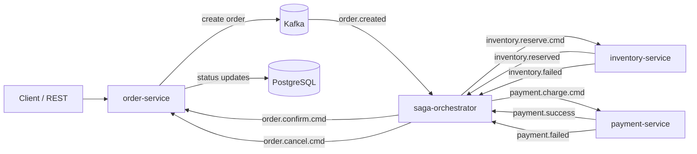
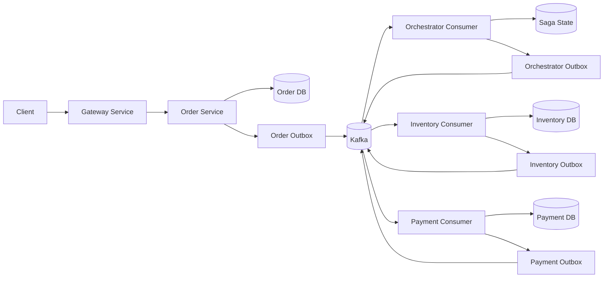
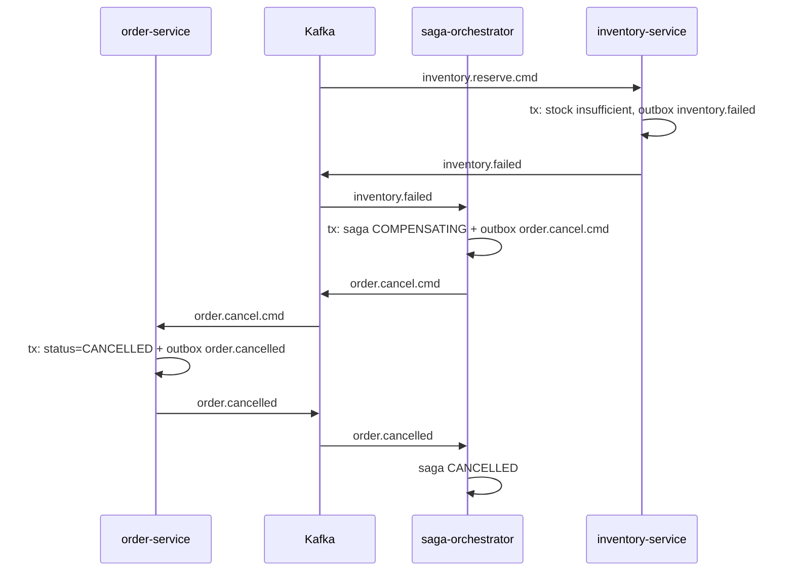
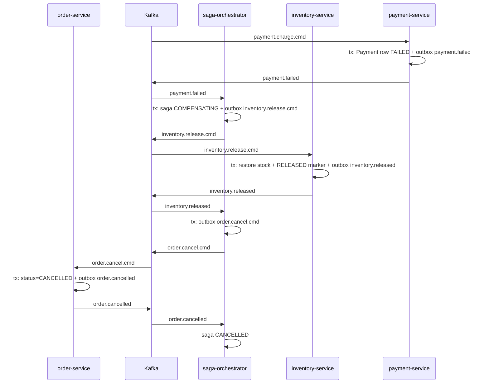
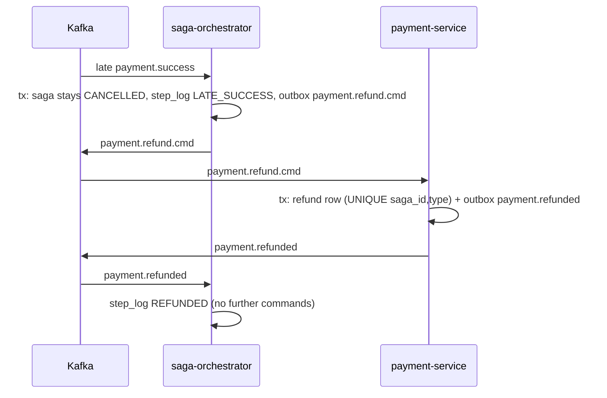
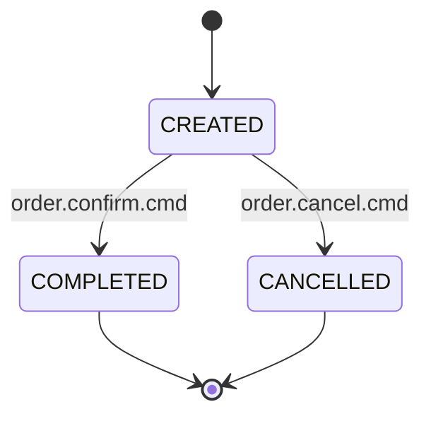
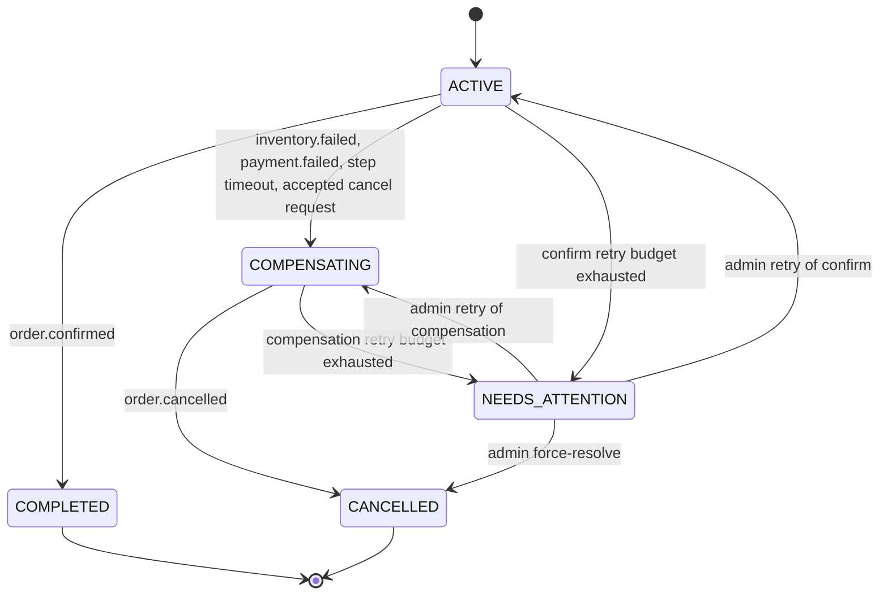

# Design for the distributed order-management system

## 1. Summary and scope

This document defines the target design for the repository as it exists today, with the findings from the audit treated as the source of truth. The main corrective shift is to make the saga orchestrator the only authority that moves Order status, while each service remains idempotent under at-least-once Kafka delivery.

The design intentionally preserves existing service boundaries: `order-service`, `inventory-service`, `payment-service`, `saga-orchestrator`, `gateway-service`, and `common-dto`. The scope is correctness under failure, not a broad platform rewrite. The design is intentionally simple: state changes and outgoing messages are committed together through an outbox, consumers are idempotent, and the orchestrator persists saga state so it can resume after restart.

Key decisions already made and followed in this document:

- Pure orchestration: only the orchestrator drives Order status. Order status is written only in reaction to `order.confirm.cmd` / `order.cancel.cmd`; REST creates orders and records cancel requests.
- Outbox in every publishing service, using a poller with `FOR UPDATE SKIP LOCKED`.
- Persistent saga state: `OrderSaga` stores a String UUID `sagaId`, step log, deadline, and version.
- Payment idempotency uses `sagaId` as the natural key with a unique constraint and returns the stored result on repeat.
- Inventory uses a unique `(saga_id, event_type)` idempotency guard in the processed-event table, plus a new `inventory.released` event.
- Kafka keys are `orderId` on all topics; producers use `acks=all` and `enable.idempotence=true`.
- A repo-root parent/aggregator POM is added, with a GitHub Actions workflow.
- Gateway `permitAll` is explicitly documented as a known limitation and is not fixed in this phase.

This design is intentionally biased toward a boring, interview-safe architecture: transactional DB writes, explicit state transitions, and durable event publication, not optimistic assumptions about exactly-once processing.

## 2. As-is architecture

### Components

- `order-service`: owns Order domain state, REST API, and status transitions triggered by orchestrator commands.
- `inventory-service`: validates and reserves stock, emits `inventory.reserved` or `inventory.failed`, and later releases stock on compensating commands.
- `payment-service`: charges the customer, emits `payment.success` or `payment.failed`, and later performs refunds for compensating actions.
- `saga-orchestrator`: receives domain events and sends commands to drive the long-running saga.
- `gateway-service`: routes API traffic and is intentionally permissive in the current code.
- `common-dto`: shared command and event contracts used across services.

### Existing message flow (as audited)

The current implementation has a mix of event-driven and command-driven behavior. The orchestrator emits commands, but order-service also reacts directly to domain events. That is the root cause of status ambiguity and race-prone behavior. The design below removes that duplication by selecting a single writer.



### Data model and persistence observations

The current system already has the following persistence patterns in scope:

- Orders and inventory are stored in per-service PostgreSQL databases.
- Payment rows are stored in payment-service; inventory idempotency records and processed events are stored in inventory-service.
- The orchestrator contains `OrderSaga` as an entity, but the code does not actually use it as a persisted resume mechanism.
- Some services have `@Version` in the model layer, but not consistently across the critical write paths.
- The current code includes an `OutboxEvent` scaffold in order-service but does not actively use it for publication.

### Kafka topics and keys observed in the current code

The current implementation uses a set of event and command topics with inconsistent semantics. The target design below standardizes them around `orderId` as the message key for order-affinity ordering and consistent recovery.

- `order.created` / `order.confirmed` / `order.cancelled`
- `inventory.reserve.cmd` / `inventory.release.cmd`
- `inventory.reserved` / `inventory.failed` / `inventory.released`
- `payment.charge.cmd` / `payment.refund.cmd`
- `payment.success` / `payment.failed` / `payment.refunded`

## 3. Requirement status table

| Requirement | Status | Evidence |
|---|---|---|
| R0.1 Audit the as-is system | DONE | The repo contains an audit in `notes/audit.md` that is grounded in the checked-in code. |
| R0.2 One-command local environment | PARTIAL | Docker Compose is present for Kafka but does not yet cover the full system and database topology. |
| R0.3 Public REST API for orders | PARTIAL | REST routes exist, but there is no complete end-to-end demo script or verified runbook. |
| R1 Transactional outbox in every service that publishes | MISSING | Current code publishes directly to Kafka without a durable outbox transaction. |
| R2 Persistent saga state in the orchestrator | MISSING | `OrderSaga` exists, but there is no live persisted saga state or recovery path. |
| R3 Idempotent consumers in every service | PARTIAL | Inventory has a processed-event check; payment is not deduplicated by a natural business key. |
| R4 Kafka correctness configuration | PARTIAL | Producer/consumer config exists, but keying, offset semantics, topic creation, and retry policy are not yet consistent. |
| R5 Correct compensation semantics | PARTIAL | Compensation flows do not yet wait for specific compensating acks before final state changes. |
| R6 Explicit state machines | MISSING | Order transitions are ad hoc `if` checks, not a validated state machine. |
| R7 Timeouts and stuck-saga detection | MISSING | There is no deadline-driven timeout flow or compensating-action policy with late reply protection. |
| R8 Retry and DLQ strategy | PARTIAL | Retry/DLQ patterns exist in concept, but there is no consistent cross-service policy. |
| R9 Unit tests for state machines and logic | MISSING | The repo has light smoke/context tests, but no deterministic correctness test suite. |
| R10 Integration tests with Testcontainers | MISSING | There is no end-to-end Kafka/PostgreSQL saga failure suite. |
| R11 Chaos-lite | MISSING | There is no small fault-injection harness covering duplicates and timeouts. |
| R12 OpenTelemetry | MISSING | There is no explicit end-to-end tracing contract across Kafka and HTTP calls. |
| R13 Metrics | MISSING | There are no business-level metrics for saga age, outbox lag, or duplicates. |
| R14 Structured logging and audit trail | MISSING | Logs are not consistently structured around `traceId`, `sagaId`, and message IDs. |
| R15 Client Idempotency-Key | MISSING | No client idempotency contract exists for mutating requests. |
| R16 Inventory contention decision | PARTIAL | Inventory uses a pessimistic lock and may also have `@Version`, but the chosen canonical anti-over-sell rule is not yet explicit. |
| R17 Reservation TTL tied to the watchdog | MISSING | There is no reservation deadline tied to the saga watchdog. |
| R18 API hygiene | PARTIAL | API exists, but validation and error semantics are not yet standardized. |
| R19 README rewrite | MISSING | The README is not a trustworthy operational runbook. |
| R20 ADR list | MISSING | There is no maintained list of key architecture decisions. |
| R21 Failure matrix | MISSING | The repo does not yet include a failure matrix tied to the tested scenarios. |
| R22 Fix duplicate sendInventoryReserved | PARTIAL | The duplicate call was removed per the author's check; a regression test is still missing and the fix must be re-verified in Phase 0. |
| R23 Single-writer order status | MISSING | The order service currently mixes event-driven and command-driven status mutation. |
| R24 Parent/aggregator Maven build | MISSING | There is no root aggregator POM or CI-friendly full build target. |
| R25 String UUID `sagaId` everywhere | MISSING | The orchestrator state model still needs a consistent String UUID contract. |
| R26 Final cancel/fail outcome | MISSING | The system does not yet define one well-defined terminal state for compensated orders. |

## 4. Additional issues found in the code (ranked by severity)

1. **Two writers of Order status.** Order-service changes status from Kafka domain events and from orchestrator commands. Fixed by R6/R23.
2. **Stateless orchestrator.** `OrderSaga` exists but is unused, so a crash mid-saga cannot be resumed. Fixed by R2.
3. **Payment has no idempotency and a random outcome.** A redelivered `payment.charge.cmd` charges again and can flip the result. Fixed by R3 and Phase 1.
4. **Direct `KafkaTemplate.send` inside `@Transactional` methods.** Events can reach consumers before the commit, or for a transaction that rolls back. Fixed by R1.
5. **Duplicate `inventory.reserved` publication** (fixed in code; regression test missing). Tracked as R22.
6. **Failure paths end at `FAILED`, not `CANCELLED`.** `cancelBySaga` skips `FAILED` orders and `confirmOrder` is a no-op after the payment event already set `COMPLETED`. Fixed by R6/R26.
7. **`payment.refund.cmd` has no consumer; `order.cancelled` is never produced or consumed.** Fixed by R5.
8. **Inconsistent Kafka setup.** Payment events have no key, command keys use `orderNumber`, no `acks=all` or idempotent producer, topics are not created in code, `ack-mode: manual` is ignored by the custom container factory, and YAML group IDs differ from listener group IDs. Fixed by R4.
9. **Order race.** `handlePaymentSuccess` requires `INVENTORY_RESERVED`, so a `payment.success` processed first is silently dropped. Removed by R6.
10. **No parent POM, tests are `contextLoads()` only, schema comes from `ddl-auto: update`.** Fixed by R24, R9/R10, and the Phase 0 Flyway baseline.
11. **Gateway uses `permitAll`.** Documented as a known limitation (section 13).

## 5. Target architecture

### 5.0 Component view



### 5.1 End-to-end behavior intended by this design

The intended end state is a single, boring saga: `CREATED` -> `COMPLETED` or `CANCELLED`, with `NEEDS_ATTENTION` as a non-terminal recovery state when a compensating or retry action cannot complete within budget. The system guarantees at-least-once delivery and idempotent business effects; it does not promise exactly-once semantics.

### 5.2 Happy path sequence

```mermaid
sequenceDiagram
    participant C as Client
    participant O as order-service
    participant K as Kafka
    participant S as saga-orchestrator
    participant I as inventory-service
    participant P as payment-service
    C->>O: POST /orders (Idempotency-Key)
    O->>O: tx: insert Order(CREATED) + outbox row order.created
    O-->>C: 202 Accepted (orderId; poll GET /orders/{id})
    O->>K: outbox poller publishes order.created
    K->>S: order.created
    S->>S: tx: insert saga (ON CONFLICT DO NOTHING), step=RESERVE_INVENTORY, deadline, outbox inventory.reserve.cmd
    S->>K: inventory.reserve.cmd
    K->>I: inventory.reserve.cmd
    I->>I: tx: dedupe row + atomic stock update + outbox inventory.reserved
    I->>K: inventory.reserved
    K->>S: inventory.reserved
    S->>S: tx: step=CHARGE_PAYMENT + outbox payment.charge.cmd
    S->>K: payment.charge.cmd
    K->>P: payment.charge.cmd
    P->>P: tx: insert Payment UNIQUE(saga_id,type) + outbox payment.success
    P->>K: payment.success
    K->>S: payment.success
    S->>S: tx: step=CONFIRM_ORDER (pivot passed) + outbox order.confirm.cmd
    S->>K: order.confirm.cmd
    K->>O: order.confirm.cmd
    O->>O: tx: status=COMPLETED + outbox order.confirmed
    O->>K: order.confirmed
    K->>S: order.confirmed
    S->>S: saga COMPLETED
```

### 5.3 Inventory failure path

Reservation is all-or-nothing inside one inventory transaction, so a failed reservation leaves nothing to release.



### 5.4 Payment failure with release-then-cancel



### 5.5 Late payment.success for a saga that already compensated or cancelled

Precondition: an earlier step timed out, so the saga is `COMPENSATING` or `CANCELLED`, but the payment actually went through and its `payment.success` arrives late. The saga status does not change (`CANCELLED` is terminal); the event is recorded in `saga_step_log` and only the refund is issued. Inventory release is sent only if it was not yet acknowledged.



### 5.6 Timeout handling with compensating command and late reply safety

```mermaid
sequenceDiagram
    participant S as Saga Orchestrator
    participant I as Inventory Service
    participant P as Payment Service
    participant O as Order Service
    participant DB as PostgreSQL

    S->>I: inventory.reserve.cmd
    I-->>S: no reply within deadline
    S->>DB: mark saga as COMPENSATING
    S->>I: inventory.release.cmd
    I->>DB: inventory.release writes the RELEASED marker; emit inventory.released
    I-->>S: inventory.released
    S->>O: order.cancel.cmd
    O->>DB: set status=CANCELLED and emit order.cancelled outbox
    Note over S: late inventory.reserved arrives later
    I-->>S: late inventory.reserved
    S->>DB: reject state transition because compensation is already in progress; count as out-of-order and apply no side effects
    Note over S: the same rule applies to payment: payment.refund.cmd writes a (saga_id, REFUNDED) marker, so a later payment.charge.cmd for that saga is rejected
```

## 6. Detailed design

### R1. Transactional outbox in every service that publishes to Kafka

Problem in the current code
- The existing services publish directly to Kafka from business methods instead of writing a durable outbox row in the same transaction as the business write.
- The `OutboxEvent` scaffold is present in order-service but never drives publication in practice.

Chosen approach and alternatives
- Every publish path writes the business change and a single outbox row in the same DB transaction. A dedicated poller then picks rows and sends Kafka messages.
- The outbox row includes `message_id`, `aggregate_type`, `aggregate_id`, `event_type`, `payload`, `headers`, `status`, `attempt_count`, `lease_until`, `created_at`, `published_at`, `last_error`.
- Poller locking is: `SELECT ... FOR UPDATE SKIP LOCKED` in a short claim transaction that sets `status=IN_PROGRESS` and `lease_until`; the message is published outside that claim and the row is then marked `PUBLISHED` or `FAILED`. A lease-expiry sweeper resets stuck rows so a crashed poller cannot hold them forever.
- Multiple pollers may reorder messages for the same order when they claim per `aggregate_id`, so the design guarantees per-aggregate ordering only when rows are processed in `created_at` order for one aggregate; it does not promise global ordering across all aggregates.
- The poller stops at the first failed row of an aggregate; it does not publish later rows of that aggregate ahead of it, so per-aggregate order is preserved.
- Alternative considered: Debezium CDC. Rejected here because it adds operational complexity without being required to satisfy the repos correctness problem.

Data model changes
- Create an `outbox` table in each publishing service.
- DDL sketch: `message_id UUID PRIMARY KEY`, `aggregate_type TEXT NOT NULL`, `aggregate_id TEXT NOT NULL`, `event_type TEXT NOT NULL`, `payload JSONB NOT NULL`, `headers JSONB NOT NULL`, `status VARCHAR(16) NOT NULL DEFAULT 'NEW'`, `attempt_count INT NOT NULL DEFAULT 0`, `lease_until TIMESTAMP WITH TIME ZONE NULL`, `created_at TIMESTAMP WITH TIME ZONE NOT NULL DEFAULT now()`, `published_at TIMESTAMP WITH TIME ZONE NULL`, `last_error TEXT NULL`, `version BIGINT NOT NULL DEFAULT 0`.
- Composite index on `(status, created_at)` and `(aggregate_type, aggregate_id, created_at)`.
- Presence of `message_id` is required for dedupe and replay safety at the consumer boundary.

Kafka topics, keys, and headers
- Topics remain consistent with order, inventory, and payment domain events/commands; order-service also emits `order.confirmed` and `order.cancelled` through its outbox after state changes.
- Message key remains `orderId` for all order-related topics.
- Headers include `messageId`, `sagaId`, `orderId`, `traceId`, `eventType`.

Class-level changes
- Existing outbox classes are extended to carry a `messageId` and a small `OutboxPoller` that continuously polls and posts rows.
- Order-service writes outbox rows for both `order.created` and its later `order.confirmed` / `order.cancelled` events.

Transaction boundaries
- Business write + outbox insert happen in the same transaction.
- The Kafka publish happens after the commit, and the row is marked published or failed only after the producer call returns.
- Ordering guarantee is per aggregate: for a given `aggregate_id`, rows are processed in `created_at` order. Multi-poller concurrency can reorder messages across different aggregates; that is acceptable because the system is not assuming cross-aggregate global ordering.

Failure scenarios handled
- Crash after DB commit but before Kafka send: row remains in `NEW`/`IN_PROGRESS` and is re-sent by the poller.
- Poller crash: a lease or `FOR UPDATE SKIP LOCKED` prevents duplicate work.
- Producer fails: row stays not-published; retry increment occurs and the message is eventually retried.

How it will be tested
- Unit test: outbox write gets created with a unique `messageId` in the same transaction as the business row.
- Integration test: DB commit then crash before send, and verify eventual delivery with a single message.

### R2. Persistent saga state in the orchestrator

Problem in the current code
- `OrderSaga` is present but not the real source of truth; no live saga state is persisted for recovery.
- The orchestrator cannot resume after restart, nor can it reject out-of-order or duplicate events cleanly.

Chosen approach and alternatives
- Introduce `saga_instance` and `saga_step_log` tables and persist the sagas state and step transitions in the same transaction as any command emission.
- Use `version` for optimistic concurrency and `deadline_at` for timeout handling.
- The saga row is created with `INSERT ... ON CONFLICT DO NOTHING` when `order.created` arrives, so a redelivered `order.created` does not create a second saga.
- Events for one saga can arrive on different topics and be consumed by different threads, so each handler first runs `SELECT ... FOR UPDATE` on the `saga_instance` row (serializing events per saga); `version` is a safety net.
- Alternative considered: replay from Kafka only. Rejected because the state would still be ambiguous after an unclean crash and late events would be impossible to reason about.

Data model changes
- `saga_instance` columns: `id BIGSERIAL PK`, `saga_id VARCHAR(36) UNIQUE NOT NULL`, `order_id BIGINT NOT NULL`, `status VARCHAR(32) NOT NULL`, `current_step VARCHAR(64) NOT NULL`, `deadline_at TIMESTAMP WITH TIME ZONE NULL`, `started_at TIMESTAMP WITH TIME ZONE NOT NULL`, `updated_at TIMESTAMP WITH TIME ZONE NOT NULL`, `version BIGINT NOT NULL DEFAULT 0`.
- `saga_step_log` columns: `id BIGSERIAL PK`, `saga_id VARCHAR(36) NOT NULL`, `step_name VARCHAR(64) NOT NULL`, `event_type VARCHAR(64) NOT NULL`, `from_state VARCHAR(32) NULL`, `to_state VARCHAR(32) NULL`, `payload JSONB NULL`, `created_at TIMESTAMP WITH TIME ZONE NOT NULL`.
- Indexes: `(saga_id, current_step)` and `(saga_id, event_type)`; no `created_at`-based index is needed for step log dedupe because duplicates are not inserted. This follows the requirement that duplicates are counted in a metric/log, not written to the step log.

Kafka topics, keys, and headers
- Orchestrator consumes `order.created`, `inventory.reserved`, `inventory.failed`, `inventory.released`, `payment.success`, `payment.failed`, `payment.refunded`, `order.confirmed`, and `order.cancelled`.
- Commands are emitted with `orderId` as the Kafka key and include `messageId`, `sagaId`, `orderId`, and `traceId` headers.

Class-level changes
- `SagaServiceImpl` is converted into a state-machine-backed service that validates transitions and persists the next state as part of the same transaction as the outbox insert.
- Add `OrderSagaRepository` and `SagaStepLogRepository`.
- The orchestrator dedupes incoming events with a `processed_message` table keyed by `(consumer, message_id)` and rejects invalid transitions before a business side effect is applied.

Transaction boundaries
- Reads the current saga state, validates the allowed step, updates the DB, inserts the outbox row, and only then commits. The offset is acknowledged only after the DB transaction returns successfully.

Failure scenarios handled
- Crash during a step: the persisted saga row resumes at the last durable step.
- Duplicate event: same `message_id` is recognized by the `processed_message` table and ignored; duplicate counts are recorded in metrics/logs.
- Out-of-order event: invalid for the current state and rejected without side effects.

How it will be tested
- Unit tests for explicit valid and invalid transitions.
- Restart test that crashes after DB write but before command send, then resumes and continues without duplicate side effects.

### R3. Idempotent consumers in every service

Problem in the current code
- Inventory has a processed-event table but payment is not deduplicated by a natural business key.
- Duplicate Kafka deliveries can cause duplicate charges, duplicate reservations, or duplicate refunds if idempotency is not enforced atomically with the business write.

Chosen approach and alternatives
- Payment dedupe is by the natural business key: `UNIQUE(saga_id, type)` on the `Payment` row; the service uses `INSERT ... ON CONFLICT DO NOTHING` and reads the stored payment result on repeat.
- `payment.refund.cmd` for a saga whose charge never ran writes a `(saga_id, REFUNDED)` marker; a later `payment.charge.cmd` for that saga is rejected. Inventory does the same with a `(saga_id, RELEASED)` marker for release-before-reserve.
- Inventory dedupe is by `UNIQUE(saga_id, event_type)` on the inventory processed-event table; the service also uses `INSERT ... ON CONFLICT DO NOTHING` before applying an inventory mutation.
- The orchestrator dedupes by `processed_message` with `UNIQUE(consumer, message_id)`.
- Alternative considered: a separate generic idempotency table for payments. Rejected in favour of a unique business key on the `Payment` row itself, which is simpler and lives in the same transaction as the charge.

Data model changes
- `payment` table adds `saga_id VARCHAR(36)` and a unique constraint `UNIQUE(saga_id, type)`.
- `processed_inventory_event` table adds `saga_id VARCHAR(36) NOT NULL`, `event_type VARCHAR(64) NOT NULL`, `processed_at TIMESTAMP WITH TIME ZONE NOT NULL DEFAULT now()`, plus `UNIQUE(saga_id, event_type)`.
- `processed_message` table for orchestrator dedupe: `consumer_name TEXT NOT NULL`, `message_id UUID NOT NULL`, `processed_at TIMESTAMP WITH TIME ZONE NOT NULL DEFAULT now()`, `PRIMARY KEY (consumer_name, message_id)`.

Kafka topics, keys, and headers
- All commands/events retain `orderId` as the key and `sagaId` as the business correlation ID in the payload or headers.

Class-level changes
- Service consumer methods do the dedupe insert and the business write in the same transaction.
- Duplicate messages return the previous stored result instead of re-executing the business side effect.

Transaction boundaries
- The dedupe insert and business write occur in a single transaction, before the consumer offset is acknowledged.

Failure scenarios handled
- Duplicate `payment.charge.cmd`: the `INSERT ... ON CONFLICT DO NOTHING` succeeds or fails atomically; the service reads the stored result and emits the original outcome again if needed.
- Duplicate inventory event: same `saga_id` / `event_type` is ignored and the stored result is returned.

How it will be tested
- Integration tests for duplicate payment charge delivery, duplicate inventory reserve, and duplicate orchestrator message IDs.

### R4. Kafka correctness configuration

Problem in the current code
- Kafka configuration is not consistently aligned with the actual consumer behavior.
- The YAML shows `ack-mode: manual` but no listener calls `Acknowledgment.acknowledge()`, so in practice the configured behavior is not active.
- Producer keys and partition semantics are not standardized across all services.

Chosen approach and alternatives
- Standardize on `orderId` as the message key for every topic, including orchestrator commands and service-emitted events.
- Set producer config to `acks=all`, `enable.idempotence=true`, `retries` with bounded retry policy, and add `max.in.flight.requests.per.connection` tuned appropriately when idempotence is enabled.
- Use the default `RECORD` container `AckMode` and a `DefaultErrorHandler` with `@RetryableTopic` for transient failures; offsets are committed by the container only after the service method returns successfully and the transaction is complete.
- Explicit `NewTopic` beans create all required topics with sensible partitions. The YAML group IDs are reconciled with the `@KafkaListener` `groupId` values so that a given service family consumes the intended stream consistently.
- Alternative considered: manual acknowledgment (`MANUAL_IMMEDIATE` and `acknowledge()` in every listener). Rejected because the `RECORD` mode already commits the offset only after the `@Transactional` service method returns, so manual acks add code without adding safety.
- `@RetryableTopic` retries run on separate topics, so a retried message can be processed after later messages for the same order. Handlers must tolerate reordering; the saga state checks and the RELEASED/REFUNDED markers provide that.

Data model changes
- No schema-level DB change is required for the Kafka design alone; this design relies on stable keys and consumer-side safe commit semantics.

Kafka topics, keys, and headers
- Topics include `order.created`, `order.confirmed`, `order.cancelled`, `inventory.reserve.cmd`, `inventory.release.cmd`, `inventory.reserved`, `inventory.failed`, `inventory.released`, `payment.charge.cmd`, `payment.refund.cmd`, `payment.success`, `payment.failed`, `payment.refunded`, plus retry and DLQ topics named consistently by service and suffix (`@RetryableTopic` defaults: `-retry-N` and `-dlt`).
- Keys are always `orderId` to preserve ordering within each order stream.
- Headers include `messageId`, `sagaId`, `orderId`, `traceId`, `eventType`.

Class-level changes
- Add `@Bean NewTopic` declarations for the canonical topics and for retry/DLQ topics.
- Add `@KafkaListener` `groupId` values that match the YAML `spring.kafka.consumer.group-id` configuration for each service.
- Use `@RetryableTopic` for generic transient failures and keep a DLQ topic for poison messages.

Transaction boundaries
- The producer sends after the DB commit; the consumer processes the message, commits the business write and idempotency insert in the same transaction, and only then allows the Kafka container to commit the offset.

Failure scenarios handled
- Dead letter during a transient issue: `@RetryableTopic` retries with backoff.
- Permanent poison message: DLQ is used and the failure is visible in logs and metrics.
- Duplicate or replayed event: consumer idempotency rejects the duplicate before a side effect.

How it will be tested
- Integration tests verifying `acks=all`, topic creation, retry flow, and consistent group IDs across service startup.

### R5. Correct compensation semantics

Problem in the current code
- The previous design treated compensation as an afterthought and could silently ignore a late success or a lost confirm signal.
- The design must now be explicit: payment success is the pivot and the order is only confirmed after that success is durable.

Chosen approach and alternatives
- `payment.success` is the point of no return for the normal success path. Once payment is successful, the orchestrator may continue to the confirm step, but if `order.confirm.cmd` is not acknowledged, the orchestrator retries it idempotently with backoff and, if the retry budget is exhausted, moves the saga to `NEEDS_ATTENTION` rather than pretending the order is complete.
- A refund is only triggered for a real compensating scenario: a `payment.success` arriving after the saga has already moved to `COMPENSATING` or `CANCELLED` is late and therefore invalid; the orchestrator issues `payment.refund.cmd` and preserves the business effect of the refund.
- In that case the saga status stays `CANCELLED` (terminal); the late event is recorded in `saga_step_log`, only `payment.refund.cmd` is sent, and inventory release is sent only if it was not yet acknowledged.
- Alternative considered: refunding whenever the confirm step fails. Rejected because confirm is a local, idempotent command to order-service, not a payment-side failure; it is retried, not compensated. The real refund case is a late `payment.success` for a saga that already compensated or cancelled.

Data model changes
- Add `saga_id` to the `Payment` row with a unique constraint and use `INSERT ... ON CONFLICT DO NOTHING` to prevent double charging.
- Add an explicit `inventory.released` event and a `released` idempotency marker keyed by `(saga_id, event_type)` to prevent a double release or a re-run of a compensating action.

Kafka topics, keys, and headers
- The normal path stays `order.created -> inventory.reserve.cmd -> inventory.reserved -> payment.charge.cmd -> payment.success -> order.confirm.cmd -> order.confirmed`.
- The compensation path is `inventory.release.cmd -> inventory.released` and `payment.refund.cmd -> payment.refunded` with `orderId` keys and explicit saga correlation in headers.

Class-level changes
- `SagaServiceImpl` must reject a confirm step when the saga is already `COMPENSATING` or `CANCELLED` and must emit the refund path instead of treating it as a normal success.
- The order-service emits `order.confirmed` and `order.cancelled` through its outbox; the orchestrator does not directly mutate Order status.

Transaction boundaries
- The dedupe insert and side effect occur in the same transaction before the offset is committed.
- The orchestrator sends a compensating command only after the saga state transition to `COMPENSATING` is committed.

Failure scenarios handled
- Unacknowledged confirm command: retry with backoff; if retries exhaust, move to `NEEDS_ATTENTION` but never silently claim success.
- Late `payment.success`: refund based on the valid compensation state and count the duplicate as a metrics event.
- Any duplicate reply after the compensation step: reject as invalid and emit a metric/log entry only.

How it will be tested
- Duplicate late success after compensation.
- Confirm command retries and escalation to `NEEDS_ATTENTION`.
- Refund path after a late success is idempotent and does not create a second refund.

### R6. Order state machine and single-writer status flow

Problem in the current code
- The current system mixes event-driven and command-driven order status mutations and has an ambiguous set of intermediate states.
- The target design collapses the state machine to a simpler and safer order lifecycle.

Chosen approach and alternatives
- Order status has exactly three states: `CREATED` (shown to clients as `PENDING`), `COMPLETED`, and `CANCELLED`.
- The old `INVENTORY_RESERVED`, `PAYMENT_*_PENDING` and `FAILED` states are removed from the public order model; reservation progress lives in the saga step and in the inventory database.
- The orchestrator is the only component that drives the order lifecycle via `order.confirm.cmd` and `order.cancel.cmd`; order-service changes status only in reaction to those commands (REST only creates orders and records cancel requests), then emits `order.confirmed` / `order.cancelled` through its outbox.
- User cancellation: `PUT /orders/{id}/cancel` does not write the status itself. It records a cancel request through the outbox (`order.cancel.requested`). The saga accepts it only before the payment pivot (then compensates and sends `order.cancel.cmd`) and rejects it afterwards. The REST call returns 202; the outcome is visible through `GET /orders/{id}`.
- Alternative considered: retaining `FAILED` and the two `*_PENDING` states was rejected because they add ambiguity and are not needed when a saga can show `NEEDS_ATTENTION` as a recovery state outside the public order status tree.

Data model changes
- `Order.status` only accepts `CREATED`, `COMPLETED`, `CANCELLED`.
- `displayStatus` can still show `PENDING` while the order is created but not yet terminal.

Kafka topics, keys, and headers
- Order-service emits `order.confirmed` and `order.cancelled` through the outbox after it updates the DB row.
- The orchestrator is the consumer of the `order.confirmed` and `order.cancelled` domain events and completes the saga on those messages.

Transaction boundaries
- The order-service writes the status update and outbox row within one transaction, then commits. The Kafka publish occurs after the commit.

Failure scenarios handled
- Duplicate `order.confirm` or `order.cancel` command: the order-service validates the current state before writing and rejects invalid transitions.
- Late or repeated completion/cancel messages: the system ignores them after the terminal state is reached.

How it will be tested
- Unit tests for valid transitions and illegal transitions.
- Integration tests for order confirm/cancel actions emitted via the outbox and consumed by the orchestrator.

### R7. Timeouts and stuck-saga detection

Problem in the current code
- The repo has no explicit deadline or watchdog path for stalled work.
- When a step never responds, the system cannot safely distinguish not yet complete from permanently failed.

Chosen approach and alternatives
- A step times out when it exceeds its deadline without a durable reply. The orchestrator marks the saga as `COMPENSATING`, sends the compensating command for the timed-out step (`inventory.release.cmd` or `payment.refund.cmd`), and waits for the compensating acknowledge before proceeding.
- `NEEDS_ATTENTION` is a non-terminal recovery state used only when the compensation or retry path itself cannot be acknowledged within its retry budget; it is not the way a normal timeout is finalized.
- The orchestrator must reject late replies that imply a side effect when the saga is already in `COMPENSATING` or `CANCELLED`.
- Alternative considered: marking the saga `FAILED` and leaving the side effects unresolved was rejected because it is not a well-defined terminal state for compensating flows.

Data model changes
- Add `deadline_at`, `last_heartbeat_at`, and `version` to `saga_instance`; step log records are appended only for valid, durable transitions.
- Add a retry budget and a `needs_attention` flag on the step or saga record to allow manual admin recovery.

Kafka topics, keys, and headers
- Unknown-outcome timeouts trigger `inventory.release.cmd` or `payment.refund.cmd` with the same `orderId` key and the current `sagaId` in headers.
- Later replies are ignored after the state becomes compensating, but still counted and logged as duplicates.

Class-level changes
- Add a watchdog job that scans for timed-out sagas and transitions them to `COMPENSATING` atomically with the compensating command emission.
- Add an admin endpoint or CLI command to retry or force-resolve a saga stuck in `NEEDS_ATTENTION`.

Transaction boundaries
- The saga state transition to `COMPENSATING` and the compensating outbox row are inserted in the same transaction.
- The command is not considered complete until the service acknowledges the compensating command.

Failure scenarios handled
- Inventory never replies: trigger `inventory.release.cmd` when the reservation is still pending and wait for the ack.
- Payment never replies: trigger `payment.refund.cmd` when the payment step is uncertain and wait for the ack.
- Late reply after compensation: reject, count, and log without side-effect.

How it will be tested
- Timed-out inventory reserve and payment charge flows.
- Late `inventory.reserved` or `payment.success` arriving after compensation begins.
- `NEEDS_ATTENTION` recovery path through the admin retry/resolve API.

### R8. Retry and DLQ strategy

Problem in the current code
- Retries and dead-letter behavior exist only conceptually; they are not formalized as a consistent contract across the services.

Chosen approach and alternatives
- Use `@RetryableTopic` for transient failures with backoff and a DLQ topic for poison messages.
- Retry only for classes of exceptions that are known to be transient (timeouts, temporary dependency issues, optimistic locking conflicts, transient network failures). Permanent validation failures or poison payloads go directly to the DLQ.
- Keep DLQ messages with original headers plus failure reason and stack information. A replay script or admin endpoint allows re-injecting a message after review, with idempotent consumers making replay safe.
- Alternative considered: a database table of failed messages. Rejected because the DLQ topic is already a durable record and a replay script is simpler to operate.

Data model changes
- No separate table for failed messages is required. The DLQ topic is the durable source of truth for replay.

Kafka topics, keys, and headers
- Topics include `*-retry-N`, `*-dlt`, plus the main topics. The same `orderId` key is preserved in replay so the order stream remains predictable.

Class-level changes
- Add `@RetryableTopic` and a `DefaultErrorHandler` on each listener.
- Expose a small replay script or admin endpoint that reads from the DLQ topic and re-sends the original payload after an operator review.

Transaction boundaries
- The consumer must finish the business write and idempotency insert before offset commit, otherwise retries could duplicate work.

Failure scenarios handled
- Transient dependency outage: retry with backoff and eventual success.
- Poison message: immediate DLQ routing.
- Replay: safe because the consumers are idempotent and reject duplicates by natural business key or `message_id`.

How it will be tested
- Retry then success path.
- Poison message to DLQ.
- Replay of a previously failed message with idempotent repeated processing.

### R9. Unit tests

- State machine tests for order lifecycle and saga transitions.
- Idempotency tests for `Payment` by `(saga_id, type)` and inventory by `(saga_id, event_type)`.
- Money and rounding tests for `BigDecimal` payments and refunds.
- Orchestrator decision tests for timeout, compensation, and late-reply rejection.

### R10. Testcontainers

- Kafka + PostgreSQL integration suite covering the happy path, inventory failure, payment failure, duplicate delivery, out-of-order events, crash/restart, and timeout scenarios.
- The stack must run under a single test harness and isolate each scenario without relying on local developer state.

### R11. Chaos-lite

- A small fault-injection harness that stops one service mid-saga, restarts it, and proves the system converges to a consistent terminal state without duplicate side effects.
- Include the scenarios that simulate lost acknowledgements, delayed replies, and replays after restart.

### R12. OpenTelemetry

- Spans across HTTP and Kafka; `traceId`, `sagaId`, `orderId`, and the component name are propagated through message headers and MDC.
- `tempo` or `jaeger` is included in the local stack for end-to-end troubleshooting.

### R13. Metrics

- Micrometer + Prometheus counters and gauges for saga starts, completions, compensations, retries, DLQ count, duplicate-event count, outbox backlog, and step latency.
- Business-level metrics are part of the required correctness proof, not an afterthought.

### R14. Structured logging and audit trail

Problem in the current code
- Logs carry a `traceId` in MDC but no consistent saga or message correlation, and there is no durable record of state changes.

Chosen approach
- Every service logs JSON with `traceId`, `sagaId`, `orderId`, `messageId`, `eventType` and the service name.
- Audit trail: the orchestrator's `saga_step_log` records every saga transition; order-service adds an `order_status_history` table (`order_id`, `from_status`, `to_status`, `command_message_id`, `changed_at`) written in the same transaction as each status change.

How it will be tested
- One integration flow asserts that the same `traceId` and `sagaId` appear in all services' logs and that the history tables contain the expected transitions.

### R15. Client Idempotency-Key

Problem in the current code
- A retried or double-clicked `POST /orders` creates two orders.

Chosen approach
- `POST /orders` requires an `Idempotency-Key` header (missing key gives 400).
- Table in order-service: `idempotency_key(client_key, endpoint, request_hash, response_status, response_body, order_id, created_at)` with `UNIQUE(client_key, endpoint)`.
- Inside the same transaction as the order insert: insert the key with `ON CONFLICT DO NOTHING`. If the key already exists with the same `request_hash`, return the stored response; with a different hash, return 409.
- Rows are removed by a cleanup job after 24 hours.

How it will be tested
- Same key twice returns the same order id and creates one order; same key with a different body returns 409; concurrent requests with the same key create one order.

### R16. Inventory contention decision

- Primary approach: atomic conditional update is the canonical anti-over-sell mechanism.
- Example: `UPDATE inventory SET available = available - :qty WHERE product_id = :id AND available >= :qty`.
- The pessimistic lock remains as a fallback when the DB or domain needs a stronger lock, but it is not the primary solution.
- `@Version` may remain for optimistic locking or concurrency detection, but it does not replace the atomic conditional update as the guard for oversell prevention.

### R17. Reservation TTL tied to the watchdog

Problem in the current code
- Reserved stock has no time limit and can stay held forever if the saga stalls.

Chosen approach
- A reservation is valid only until the saga's `deadline_at`; there is no separate TTL clock. Per-step deadlines are configurable (defaults: reserve 30s, charge 60s, confirm 30s).
- The watchdog scans `status IN (ACTIVE, COMPENSATING) AND deadline_at < now()` and, in one transaction, moves the saga to `COMPENSATING` and writes `inventory.release.cmd` (and `payment.refund.cmd` when the payment step is unknown) to the outbox.
- Release is idempotent through the `(saga_id, RELEASED)` marker.

How it will be tested
- A reserve command with no payment reply leads to stock being restored after the deadline; a late reply after that is rejected.

### R18. API hygiene

- Validate request bodies, standardize error payloads, and ensure no sensitive data is logged.
- This phase keeps authentication and authorization outside the core correctness work but documents them as known limitations.

### R19. README rewrite

- Remove unverified claims and replace them with a tested runbook, diagrams, configuration notes, and a known-limitations section.
- Include how to run the stack, how to reproduce the failure scenarios, and how to inspect Kafka and DB metrics.

### R20. ADR list

- Add `docs/adr` with decisions for orchestration, outbox, idempotency, inventory contention, retry/DLQ, and the use of a shared DTO module.
- Each ADR should state the decision, the context, the consequences, and the rejected alternatives.

### R21. Failure matrix

- A scenario table stating: issue, observable effect, compensating action, expected status, and which automated test proves it.
- Include late `payment.success`, release-before-reserve race, timed-out inventory reservation, timed-out payment charge, and poison message handling.

### R22. Fix the duplicate sendInventoryReserved call

- Fix the duplicate `sendInventoryReserved` call in `InventoryServiceImpl.processReserve` and add a regression test covering duplicate emission under the success flow.
- The current code must prove the service emits only one inventory-reserved message for one successful reservation.

### R23. Single writer of Order status

- Decide on one status-writer policy only: order status is written only by orchestrator commands, never by domain events; REST only creates orders and records cancel requests (see R6).
- Document the decision and enforce it in the code and in the integration tests.

### R24. Parent/aggregator POM

- Add a root parent/aggregator POM so `mvn verify` builds and tests every module from a single command.
- Include the shared DTO module and the GitHub Actions workflow in the same build path.

### R25. `sagaId` is a String UUID everywhere

- Use `String sagaId` consistently across the orchestrator, payment, inventory, and order models.
- Remove any mismatched type or implicit conversion and document the contract in the DTOs and DB schema.

### R26. Final compensated order state

- Define one terminal compensating outcome for an order that is cancelled or compensated: `CANCELLED` is the canonical state, and the system must not leave a compensated order in a fuzzy or half-failed state.
- Document the rule and prove it with the failure matrix and the timeout/retry integration tests.

## 7. State machines

### Order state machine



| From | To | Trigger | Allowed |
|---|---|---|---|
| CREATED | COMPLETED | `order.confirm.cmd` | Yes |
| CREATED | CANCELLED | `order.cancel.cmd` | Yes |
| COMPLETED | CANCELLED | any | No (terminal) |
| CANCELLED | COMPLETED | any | No (terminal) |
| CREATED | CREATED | repeated command | No-op, logged |

`CREATED` is shown to clients as `PENDING`. A repeated command that matches the current terminal state is a no-op; a conflicting one is rejected and logged.

### Saga state machine



| From | To | Trigger | Allowed |
|---|---|---|---|
| ACTIVE | COMPLETED | `order.confirmed` | Yes |
| ACTIVE | COMPENSATING | `inventory.failed`, `payment.failed`, deadline passed, cancel request before the pivot | Yes |
| COMPENSATING | CANCELLED | `order.cancelled` after the compensations were acknowledged | Yes |
| ACTIVE / COMPENSATING | NEEDS_ATTENTION | retry budget exhausted | Yes |
| NEEDS_ATTENTION | ACTIVE / COMPENSATING / CANCELLED | admin retry or force-resolve | Yes |
| COMPLETED / CANCELLED | any | any event | No; recorded in `saga_step_log`. Only a late `payment.success` has a side effect (refund). |

## 8. Kafka topics, keys, and contracts

All topics use `orderId` as the message key and 6 partitions. Retry/DLQ columns follow `@RetryableTopic` defaults (`<topic>-retry-N`, `<topic>-dlt`). Each service has one consumer group whose name is identical in the YAML and in every `@KafkaListener`.

| Topic | Producer | Consumer | Retry / DLT |
|---|---|---|---|
| `order.created` | order-service | saga-orchestrator | yes |
| `order.cancel.requested` | order-service | saga-orchestrator | yes |
| `order.confirm.cmd` | saga-orchestrator | order-service | yes |
| `order.cancel.cmd` | saga-orchestrator | order-service | yes |
| `order.confirmed` | order-service | saga-orchestrator | yes |
| `order.cancelled` | order-service | saga-orchestrator | yes |
| `inventory.reserve.cmd` | saga-orchestrator | inventory-service | yes |
| `inventory.release.cmd` | saga-orchestrator | inventory-service | yes |
| `inventory.reserved` | inventory-service | saga-orchestrator | yes |
| `inventory.failed` | inventory-service | saga-orchestrator | yes |
| `inventory.released` | inventory-service | saga-orchestrator | yes |
| `payment.charge.cmd` | saga-orchestrator | payment-service | yes |
| `payment.refund.cmd` | saga-orchestrator | payment-service | yes |
| `payment.success` | payment-service | saga-orchestrator | yes |
| `payment.failed` | payment-service | saga-orchestrator | yes |
| `payment.refunded` | payment-service | saga-orchestrator | yes |

Notes:
- Producer config: `acks=all`, `enable.idempotence=true`, bounded retries. Consumers use the default `RECORD` ack mode, so the offset is committed after the `@Transactional` service method returns.
- Every topic, including retry and DLT topics, is created by a `NewTopic` bean.
- `order.confirmed` and `order.cancelled` are written to the outbox in the same transaction as the status change.

## 9. Failure matrix

| Scenario | What happens | Expected state | Test |
|---|---|---|---|
| Happy path | Full saga ends with `order.confirmed` | Order `COMPLETED`, saga `COMPLETED` | Happy-path integration test |
| Inventory reservation fails | `inventory.failed`, saga compensates, order cancelled | Order `CANCELLED`, saga `CANCELLED` | Inventory-failure test |
| Payment fails | `payment.failed`, stock released, then order cancelled | Order `CANCELLED`, saga `CANCELLED` | Payment-failure test |
| Crash between DB commit and Kafka publish | Outbox row stays NEW/IN_PROGRESS; poller publishes after restart | Flow continues, one effect | Outbox crash test |
| Orchestrator crash mid-saga | Saga row resumes at the last durable step; duplicates rejected | Terminal state reached | Restart test |
| Duplicate `payment.charge.cmd` | `UNIQUE(saga_id, type)` returns the stored result | One payment row | Duplicate-payment test |
| Duplicate `inventory.reserve.cmd` | `UNIQUE(saga_id, event_type)` returns the stored result | One reservation | Duplicate-inventory test |
| Duplicate event at the orchestrator | `processed_message` ignores it | No second command | Orchestrator dedupe test |
| Out-of-order event | State check rejects it, counted and logged | State unchanged | Out-of-order test |
| Confirm not acknowledged | `order.confirm.cmd` retried with backoff, then `NEEDS_ATTENTION` | Saga `NEEDS_ATTENTION` | Confirm-retry test |
| Inventory reservation times out | Watchdog sets `COMPENSATING`, sends `inventory.release.cmd`, waits for ack | Order `CANCELLED` after the ack | Timeout test |
| Late `payment.success` after compensation | Saga stays terminal, step log entry, refund issued | Saga `CANCELLED`, payment refunded | Late-success test |
| Release before reserve | `RELEASED` marker makes the later reserve fail | No stock held | Race test |
| Refund before charge | `REFUNDED` marker makes the later charge fail | No charge | Race test |
| Cancel request after the pivot | Rejected; order continues to `COMPLETED` | Order `COMPLETED` | Cancel-too-late test |
| Poison message | Routed to the DLT, replayed after review | Consumer not blocked | DLT test |

## 10. Test strategy

- Unit tests exercise the state machine and decision logic.
- Integration tests use Testcontainers for Kafka and PostgreSQL.
- Chaos-lite tests simulate service restarts, delayed replies, and duplicate message delivery.
- Each phase of the rollout ships with a concrete test module proving the behavior.

## 11. Rollout plan

### Phase 0  baseline and buildability
- Parent/aggregator POM, GitHub Actions, Flyway baseline, full Docker Compose, and test harness.
- Tests: module build smoke, Docker Compose startup, default configuration checks.

### Phase 1  payment idempotency and deterministic failure rule
- Add `saga_id` to `Payment` with `UNIQUE(saga_id, type)`, use `INSERT ... ON CONFLICT DO NOTHING`, and add a deterministic, configurable failure rule.
- Tests: duplicate-charge test, deterministic failure rule test.

### Phase 2  single-writer order state machine
- Replace dual-writing with pure orchestration, emit `order.confirmed` / `order.cancelled` through the outbox, and route `PUT /orders/{id}/cancel` through `order.cancel.requested`.
- Tests: state-machine valid/invalid transition tests, outbox-emission integration tests.

### Phase 3  transactional outbox
- Add `outbox` tables to all publishing services and the poller with claim + lease logic.
- Tests: DB commit + publish crash recovery, outbox replay, duplicate send prevention.

### Phase 4  persistent saga state
- Persist `saga_instance` and `saga_step_log`, version, and deadline data. Make handlers idempotent and reject invalid late events.
- Tests: restart mid-saga, duplicate message, invalid transition rejection.

### Phase 5  compensation, timeouts, watchdog
- Add compensation commands, stepping to `COMPENSATING`, timeout policy, and the admin recovery path.
- Tests: timeout-to-compensation, late-reply rejection, release-before-reserve race, admin retry/resolve.

### Phase 6  retry and DLQ
- Add `@RetryableTopic`, DLQ topics, and a replay script.
- Tests: retry-then-success, poison-to-DLQ, replay-safe implementation.

### Phase 7  observability
- OpenTelemetry, structured logging, metrics, and Grafana dashboards.
- Tests: trace correlation across HTTP/Kafka and dashboard data validation.

### Phase 8  docs and ADRs
- README rewrite, ADR set, and failure matrix.
- Tests: documentation check for claims that are backed by automated tests.

## 12. Top 5 uncertainties

1. **Partial multi-item reservations.** The design assumes reserving all items of an order is atomic in one inventory transaction. Confirm that the current `processReserve` really is one transaction for all items.
2. **Retry budgets and step deadlines.** The defaults (reserve 30s, charge 60s, confirm 30s, retry counts) are guesses and need tuning against real latencies.
3. **User cancel timing.** The pivot (`payment.success`) is the cut-off for accepting a cancel request; a request arriving while the charge is in flight needs a clear rule (reject, or compensate after the charge).
4. **Outbox poller throughput.** Per-aggregate ordering plus single-claim polling limits throughput; acceptable for this project but unmeasured.
5. **Existing data migration.** Adding `saga_id` and unique constraints to existing payment and inventory tables must handle rows created before the change (Flyway baseline plus backfill).

## 13. Known limitations that will remain after this work

- The gateway still uses `permitAll`; there is no authentication or authorization.
- Delivery is at-least-once with idempotent processing; exactly-once is not claimed.
- The outbox uses a simple poller, not CDC, so latency and throughput are limited.
- The orchestrator is hand-rolled; a durable workflow engine (Temporal and similar) would give timers, retries and history out of the box.
- DLT replay is a manual operator action, and `NEEDS_ATTENTION` sagas need operator intervention.
- Payment is a deterministic simulation; there is no real provider, reconciliation, or unknown-outcome handling.
- The shared `common-dto` module still couples deployments; schema versioning is out of scope here.
