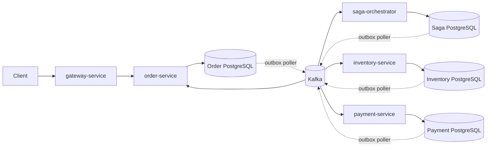
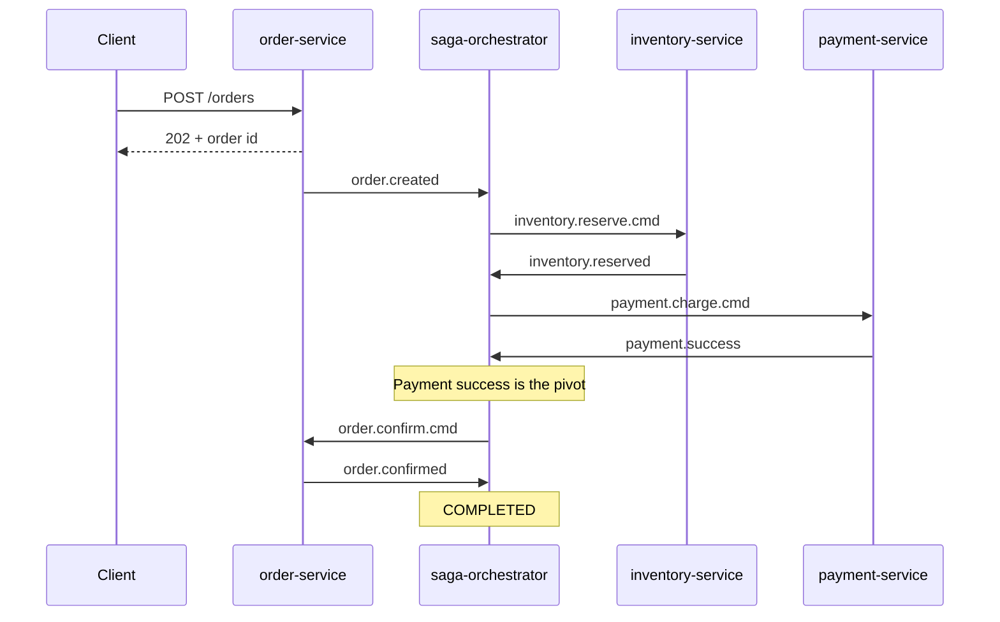
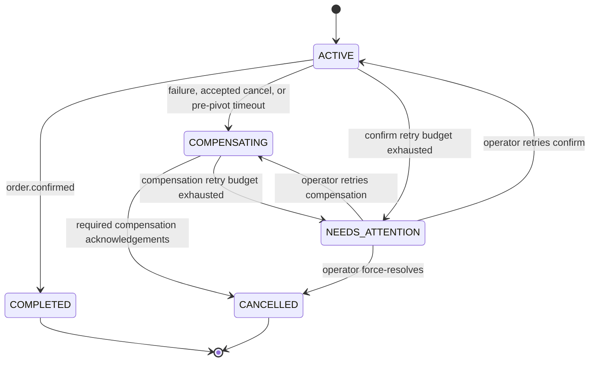

# Distributed Order Management System — As-Built Design

This document describes the implementation currently in this repository. Future
requirements and work not yet implemented are tracked in [requirement.md](requirement.md).
The implementation, rather than an earlier proposal, is the source of truth for this
document.

## 1. Runtime and modules

The project is a Java 17 Maven reactor using Spring Boot 3.2.5, Spring Kafka,
PostgreSQL, Flyway, and a shared `common-dto` module. The modules are:

| Module | Responsibility |
|---|---|
| `order-service` | Creates and reads orders, records cancellation requests, and applies confirm/cancel commands. |
| `inventory-service` | Reserves and releases inventory and records processed inventory events. |
| `payment-service` | Simulates charges and refunds with an idempotency key. |
| `saga-orchestrator` | Persists saga state, advances the workflow, handles compensation, timeouts, and operator recovery. |
| `gateway-service` | Routes client traffic to services. Its current security configuration permits requests without authentication. |
| `common-dto` | Shared Kafka command and event payloads. |

Each database-owning service has an independent PostgreSQL database and Flyway
migrations. JPA schema generation is validation-only (`ddl-auto=validate`).
Docker Compose supplies Kafka in KRaft mode and the service databases for local
development.

## 2. High-level architecture



The saga is an orchestration workflow, not a distributed database transaction.
Services commit local state and outgoing Kafka messages together where an outbox
is used. Intermediate states are visible while the saga progresses.

## 3. Order lifecycle

The client creates an order through `POST /orders` on `order-service`; the order
service stores it as `CREATED` and publishes `order.created`. The response is
asynchronous (`202`); clients read the result through the order REST API.
`CREATED` is rendered as `PENDING` in the response representation.

On `order.created`, `SagaServiceImpl` creates an `ACTIVE` saga in
`RESERVE_INVENTORY` and emits `inventory.reserve.cmd`. The normal path is:



The payment success event is the pivot. Before that point, a cancellation or
failure may initiate compensation. After it, the saga proceeds to order
confirmation rather than accepting a cancellation.

### Compensation

Inventory failure cancels the order without a release because a reservation was
not made. Payment failure triggers `inventory.release.cmd`; the orchestrator
waits for `inventory.released` before issuing `order.cancel.cmd`. When payment
may have succeeded but compensation is required, the orchestrator also issues
`payment.refund.cmd` and waits for the needed acknowledgements before
cancellation.

`inventory-service` records release-before-reserve as a `RELEASED` marker;
`payment-service` similarly records refund-before-charge as a `REFUNDED`
marker. A later corresponding reserve or charge therefore cannot create the
effect that was already compensated. Late or duplicate events are checked
against the saga state and recorded rather than allowed to progress an invalid
transition. In particular, a late `payment.success` during compensation causes
at most one refund, and a late `inventory.reserved` after compensation begins
does not trigger payment.

## 4. Persisted state and transitions

### Order state

The `orders` table is owned by `order-service`; line items are stored in
`order_items`. The order state enum is `CREATED`, `COMPLETED`, and `CANCELLED`.
`OrderStateMachine` permits the confirm and cancel commands from `CREATED`.
Repeated commands consistent with a terminal state are no-ops; conflicting
commands are rejected and logged. The orchestrator chooses the outcome, while
`order-service` alone writes order status.

### Saga state

The `saga_instance` table stores the unique `saga_id` and `order_id`, `status`,
`current_step`, `deadline_at`, `last_heartbeat_at`, `retry_count`,
`needs_attention`, timestamps, and optimistic version. `saga_step_log` stores
state/event history and payloads. `processed_message` deduplicates consumed
messages by consumer and message id. The `outbox` table stores outgoing
commands/events. These tables are created and extended by the orchestrator's
Flyway migrations.

Saga statuses are `ACTIVE`, `COMPENSATING`, `NEEDS_ATTENTION`, `COMPLETED`, and
`CANCELLED`. `SagaStep` includes `RESERVE_INVENTORY`, `CHARGE_PAYMENT`,
`CONFIRM_ORDER`, `CANCEL_ORDER`, `COMPLETED`, and `CANCELLED`.



`NEEDS_ATTENTION` is a recoverable, non-terminal state. Ordinary timeouts do not
directly set it: the watchdog first performs the step-specific recovery and
escalates only when the retry budget is exhausted.

## 5. Persistence and delivery

### Transactional outbox

Order, inventory, payment, and orchestrator database work that publishes to
Kafka uses an outbox. The local state mutation and outbox insert share a
database transaction. A poller claims eligible rows using
`FOR UPDATE SKIP LOCKED` and a lease, publishes them, then records success or
failure. Delivery is at least once; consumers and business writes are designed
to tolerate duplicate delivery. This is not an exactly-once claim.

The order service migration names its outbox table `outbox_events`; inventory,
payment, and the orchestrator use `outbox`.

### Kafka

The application topics use `orderId` as the record key and are declared with
six partitions and one replica by service `KafkaTopicsConfig` classes. Main
topic names and their producer/consumer are:

| Topic | Producer | Consumer |
|---|---|---|
| `order.created` | order-service | saga-orchestrator |
| `order.cancel.requested` | order-service | saga-orchestrator |
| `order.confirm.cmd` | saga-orchestrator | order-service |
| `order.cancel.cmd` | saga-orchestrator | order-service |
| `order.confirmed` | order-service | saga-orchestrator |
| `order.cancelled` | order-service | saga-orchestrator |
| `inventory.reserve.cmd` | saga-orchestrator | inventory-service |
| `inventory.release.cmd` | saga-orchestrator | inventory-service |
| `inventory.reserved` | inventory-service | saga-orchestrator |
| `inventory.failed` | inventory-service | saga-orchestrator |
| `inventory.released` | inventory-service | saga-orchestrator |
| `payment.charge.cmd` | saga-orchestrator | payment-service |
| `payment.refund.cmd` | saga-orchestrator | payment-service |
| `payment.success` | payment-service | saga-orchestrator |
| `payment.failed` | payment-service | saga-orchestrator |
| `payment.refunded` | payment-service | saga-orchestrator |

Messages carry identifiers including `messageId`, `sagaId`, `orderId`, and
`traceId`. `sagaId` is a string UUID. Producer configuration enables
idempotence and `acks=all`. Each service uses its configured consumer group
(`order-group`, `inventory-group`, `payment-group`, or `saga-group`).
Listeners use Spring Kafka retry topics with bounded attempts; retry topics are
named `<main-topic>-retry-N`, with `<main-topic>-dlt` for dead-letter records.
Topic creation is declared by each service's `KafkaTopicsConfig`.

Each service has `POST /admin/kafka/dlt/replay`, which accepts the DLT topic,
partition, offset, and dry-run option and can republish the original record.
These endpoints are unauthenticated and not routed through the gateway.

### Idempotency and concurrency controls

- `payment-service` uses a unique `(saga_id, type)` payment key and reuses the
  stored outcome on duplicate charge/refund requests.
- `inventory-service` records processed inventory events and uses a
  `RELEASED` marker to guard compensating release and late reserve.
- `saga-orchestrator` uses `processed_message` and locks saga rows while
  handling events. The version column is an additional consistency check.
- Inventory reservation currently loads the product row using
  `InventoryRepository.findByProductIdForUpdate`, checks available quantity,
  then saves the row. The conditional SQL update is used for release. It is not
  currently the atomic conditional decrement proposal.

## 6. Deadlines and stuck saga recovery

`SagaWatchdog` invokes `SagaServiceImpl.handleExpiredSagas()` at a configurable
interval and can be disabled with `saga.watchdog.enabled=false`. Its repository
selects expired `ACTIVE` or `COMPENSATING` rows with
`FOR UPDATE SKIP LOCKED`, making concurrent watchdog instances coordinate
through PostgreSQL locks.

Per-step deadline defaults are 30 seconds for inventory reservation, 60
seconds for payment, 30 seconds for confirmation, and 60 seconds for
compensation. Every transition establishes the deadline for the next step.
There is no separate inventory TTL clock: a reservation that has not progressed
by the saga's applicable deadline is handled by the saga timeout path.

- A reserve timeout moves to compensation and sends inventory release.
- A charge timeout moves to compensation and sends release and refund because
  the payment outcome may be unknown.
- A confirm timeout is after the pivot; it resends `order.confirm.cmd` with
  backoff and does not compensate.
- A missing compensation acknowledgement resends the missing compensation
  command with backoff.
- Confirm or compensation retries that exhaust the configurable budget move to
  `NEEDS_ATTENTION`.

Saga state changes, audit log entries, and outgoing outbox messages are written
within the same transaction. Late replies that are invalid in the current state
are rejected without triggering additional business effects and are logged.

## 7. Failure scenarios considered

The implementation and tests consider these 16 scenarios; test-level evidence
is recorded in the [failure matrix](docs/failure-matrix.md).

1. Happy path completes the order and saga.
2. Inventory reservation failure cancels the order.
3. Payment failure releases stock, then cancels the order.
4. Crash between database commit and Kafka publish; outbox delivery recovers.
5. Orchestrator crash mid-saga and recovery (**NO TEST**).
6. Duplicate `payment.charge.cmd` reuses the stored outcome.
7. Duplicate `inventory.reserve.cmd` avoids a second stock mutation (**NO TEST**).
8. Duplicate orchestrator event is ignored.
9. Out-of-order event is rejected without changing saga state.
10. Unacknowledged confirmation retries, then reaches `NEEDS_ATTENTION`.
11. Inventory reservation timeout initiates release and cancellation.
12. Late `payment.success` during compensation is logged and refunded at most once.
13. Release before reserve is blocked by the `RELEASED` marker.
14. Refund before charge is blocked by the `REFUNDED` marker.
15. Cancellation after the payment pivot is rejected; the order completes.
16. Poison-to-DLT routing and replay (**NO TEST**).

Dedicated automated coverage is still missing for orchestrator crash recovery,
duplicate inventory reserve behavior, and poison-message DLT routing,
non-blocking behavior, and replay.

## 8. Operator APIs and limitations

The orchestrator provides:

| Method and path | Purpose |
|---|---|
| `GET /admin/sagas/needs-attention` | List sagas awaiting operator action. |
| `POST /admin/sagas/{sagaId}/retry` | Retry `CONFIRM` or `COMPENSATION`; resets the retry budget. |
| `POST /admin/sagas/{sagaId}/force-resolve` | Resolve to `CANCELLED`, requiring an operator note. |

These endpoints are direct to `saga-orchestrator`, unauthenticated, and not
routed through the gateway. Each operator action is recorded in
`saga_step_log`. The gateway itself currently permits unauthenticated access;
service ports should not be exposed publicly.

Payment is a deterministic simulation, not a real payment provider. There is no
OpenTelemetry distributed tracing, Prometheus metrics, Grafana dashboard,
client `Idempotency-Key`, standardized API validation/error contract,
authentication/authorization, chaos-lite harness, or schema registry. MDC
correlation via `traceId` is not distributed tracing. Retry/DLT end-to-end
behavior and DLT replay also lack dedicated automated integration coverage.
The outstanding work is tracked in [requirement.md](requirement.md), and
scenario-level test coverage is listed in the [failure matrix](docs/failure-matrix.md).

## 9. Build and test

The repository root `pom.xml` includes all six modules. Run the full build and
tests with:

```shell
mvn -B verify
```

Integration tests use Testcontainers for Kafka and PostgreSQL; Docker must be
available. `Readme.md` documents local startup and the key test classes.
